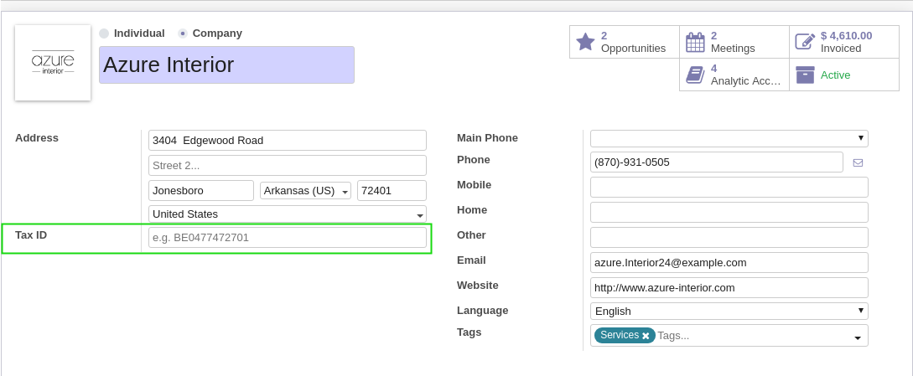
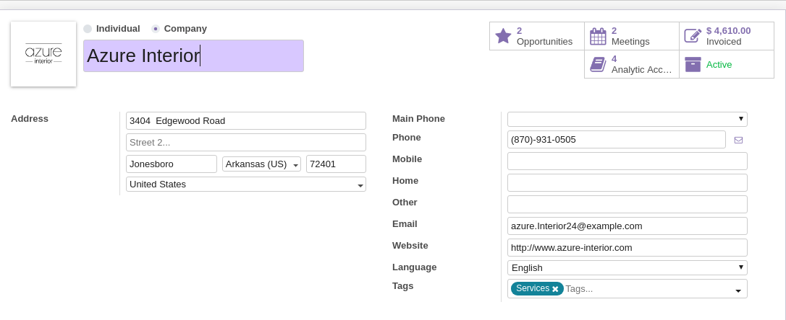
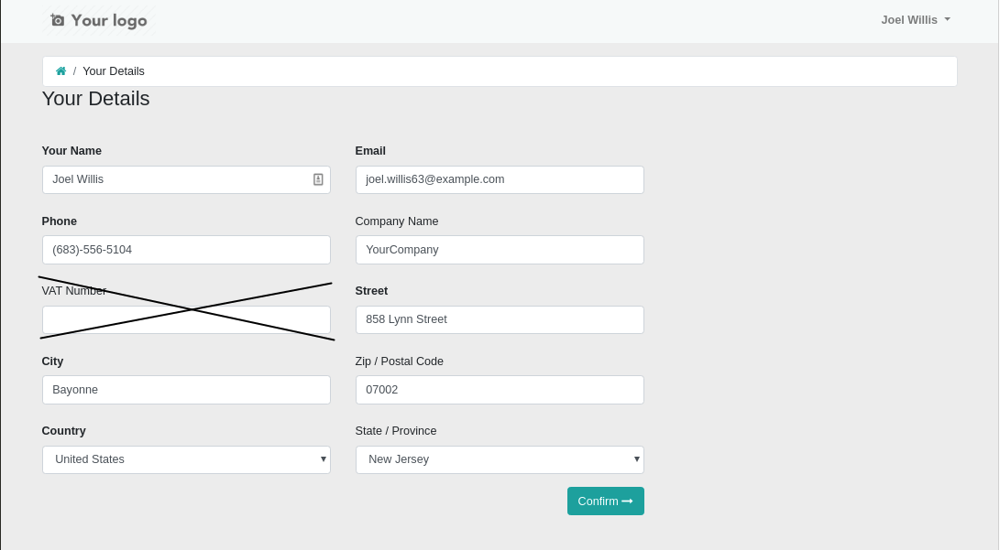

Partner No VAT
==============
This module hides the VAT field on partners.

.. contents:: Table of Contents

Context
-------
Odoo comes by default with a VAT field on partners.

This field makes sense for european companies.

However, for non-EU companies that don't trade with Europe, this field lacks purpose and is likely to create confusion.

Usage
-----
After the installation, the VAT is hidden on partners:

The VAT is also hidden on the portal account profile form:

Contributors
------------
* Numigi (tm) and all its contributors (https://bit.ly/numigiens)
