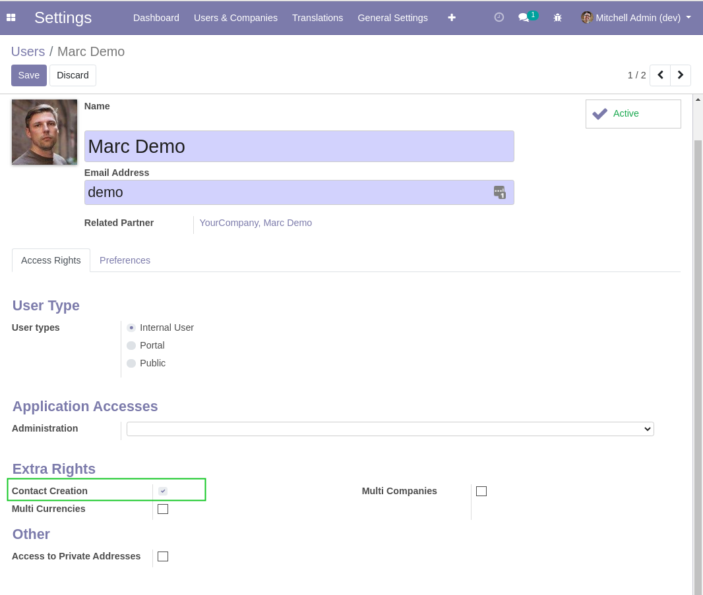
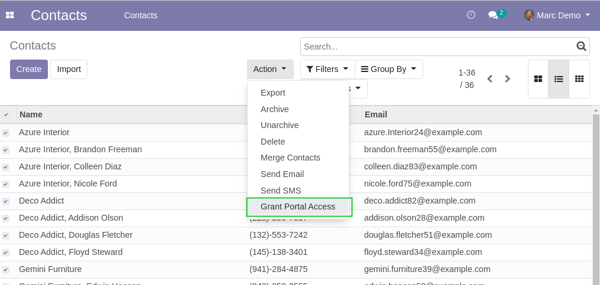
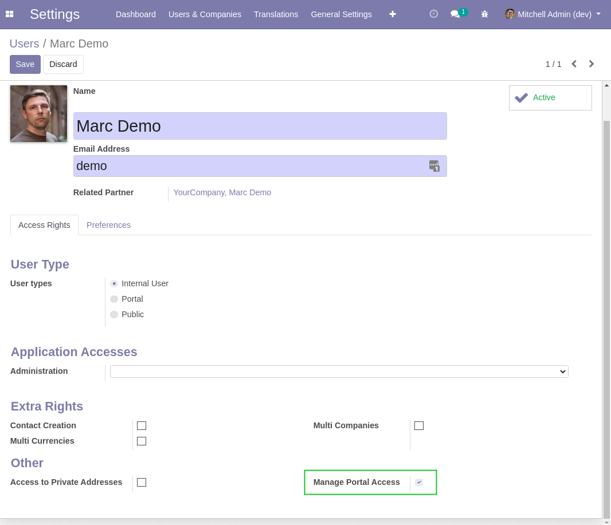

Partner Portal Access Group
===========================

.. contents:: Table of Contents

Context
-------
In vanilla Odoo, users with ``Contact Creation`` access are allowed to invite partners to the portal.

.. image:: static/description/grant_portal_access_wizard.png

This module separates this feature in another user group.
Therefore, a user may grant portal access to the customers without having access to modify the partner records.

Usage
-----
After installing this module, a new group ``Manage Portal Access`` is available.

Only members of this group are allowed to invite partners to the portal.

Contributors
------------
* Numigi (tm) and all its contributors (https://bit.ly/numigiens)

More information
----------------
* Meet us at https://bit.ly/numigi-com
