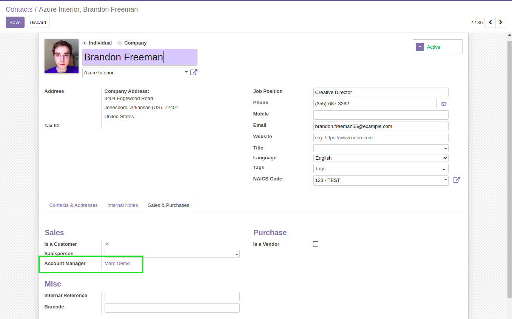

Partner Account Manager
=======================

This module adds the field ``Account Manager`` on partners.

.. image:: static/description/partner_form.png

This field allows to select a user.

On contacts and adresses, it inherits the value defined on the commercial partner.

As a user with access to the contact, I see that the column in the list view is titled “Manager” :

In “Group by” I am able to quickly group by manager :

.. image:: static/description/contact_group_by_manager.png

And filter in the quick search :

More information
----------------
* Meet us at https://bit.ly/numigi-com
