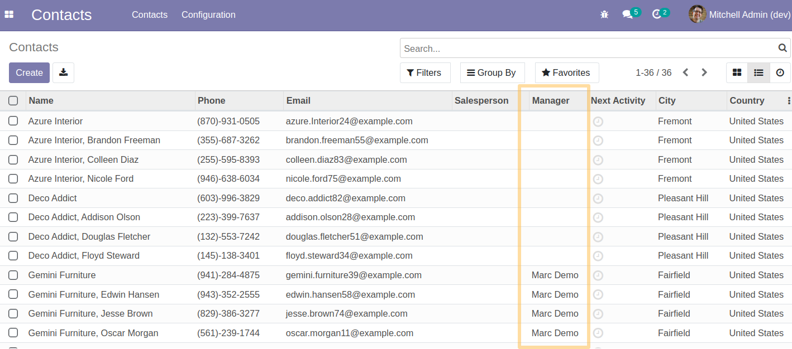
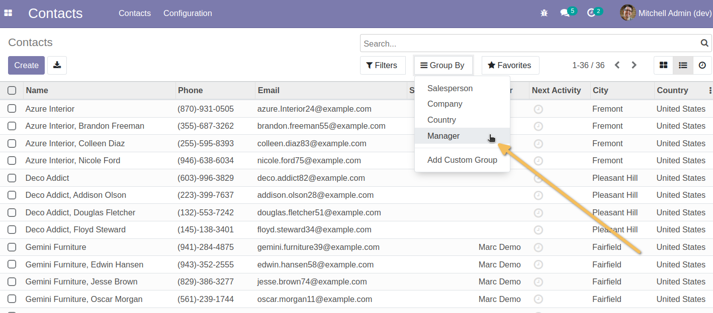
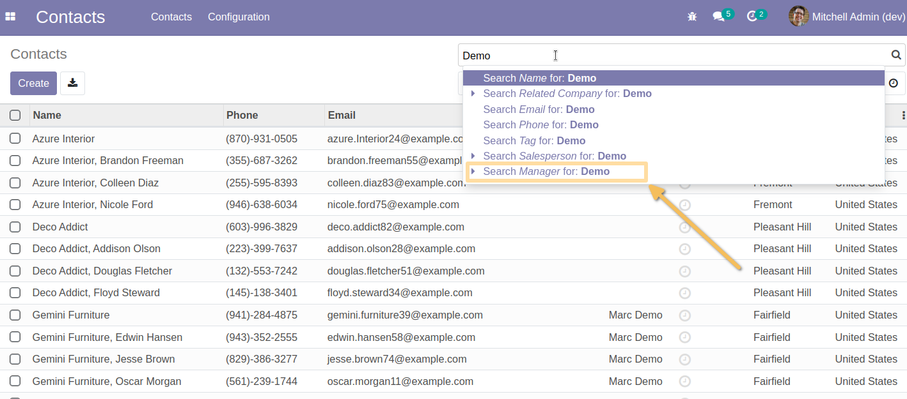
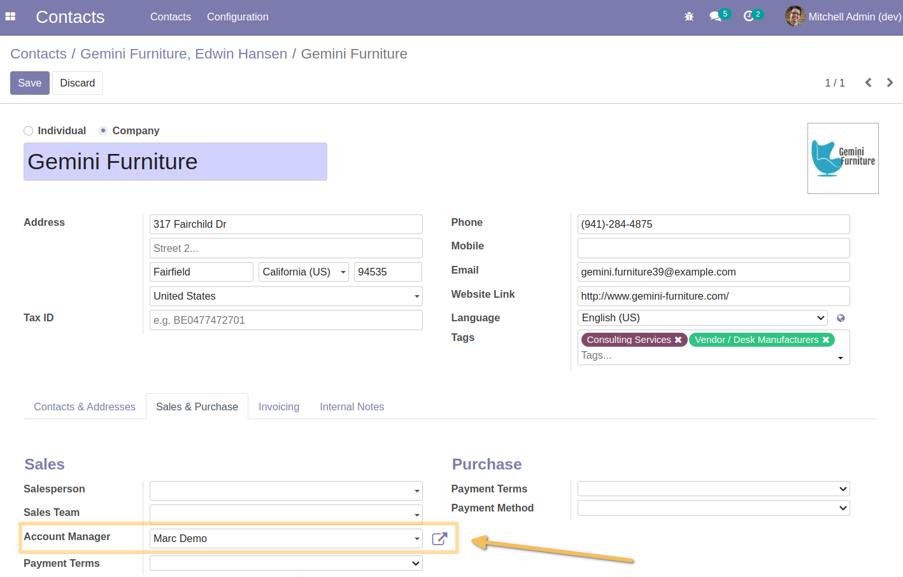
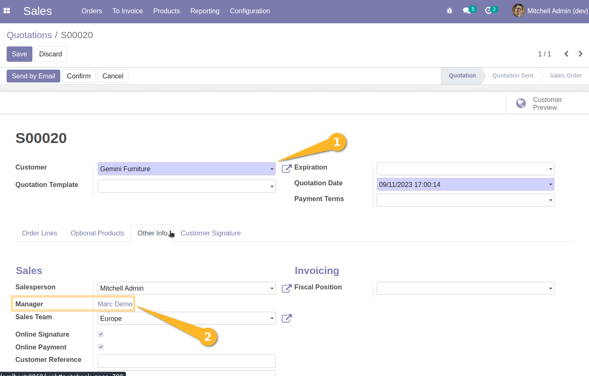
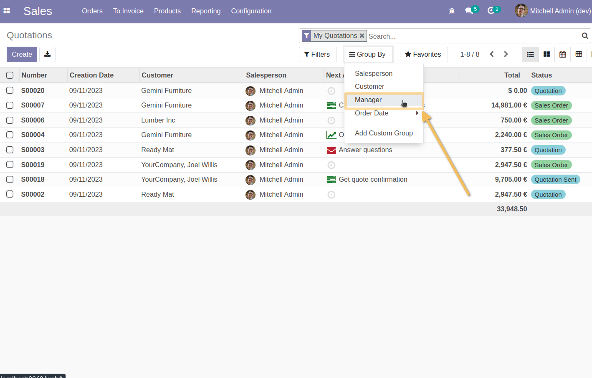
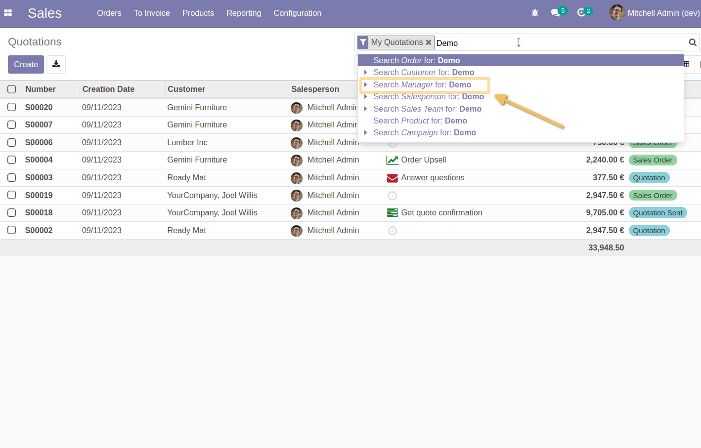

Partner Account Manager Extended
================================
This module adds the account manager field available on some view and options.

Usage
=====
* CONTACTS
As a user with access to the contact, I see that the column in the list view is titled “Manager” :

In “Group by” I am able to quickly group by manager :

And filter in the quick search :

* SALES
Once the Manager is set to the contact, then it will propagate read-only to Sales.

On the sales list view, I will be able to quickly group and search by manager

Contributors
------------
* Numigi (tm) and all its contributors (https://bit.ly/numigiens)
