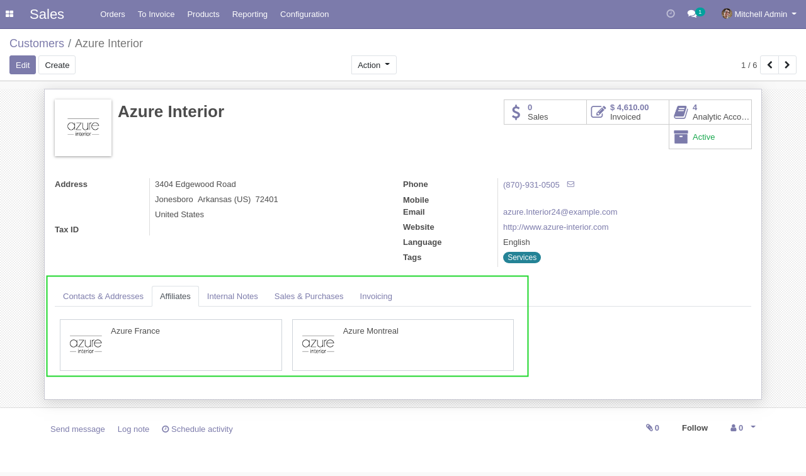
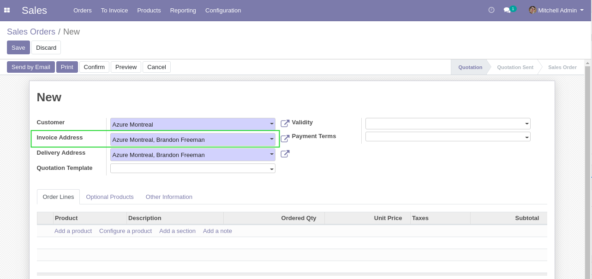
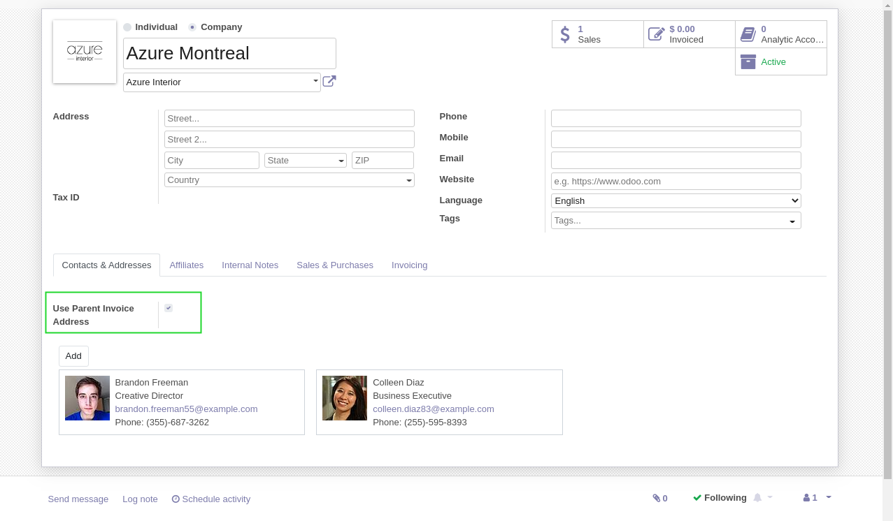
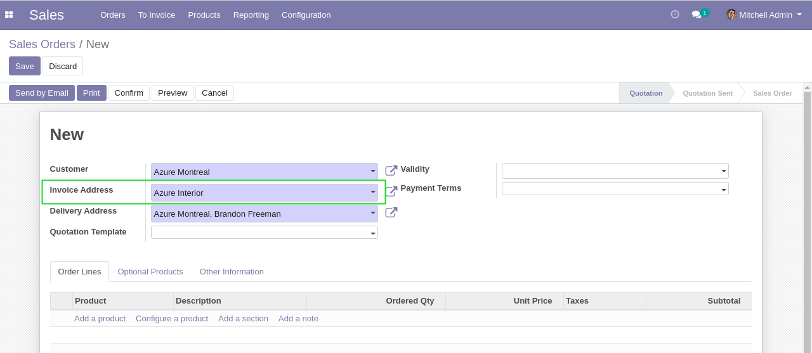
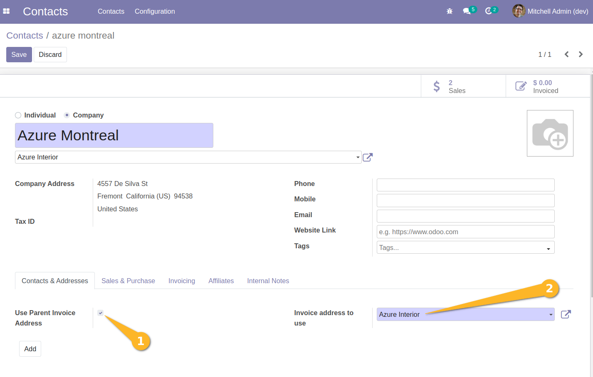
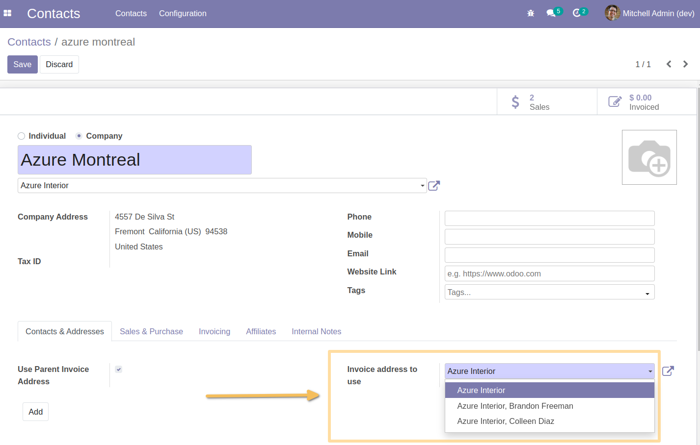
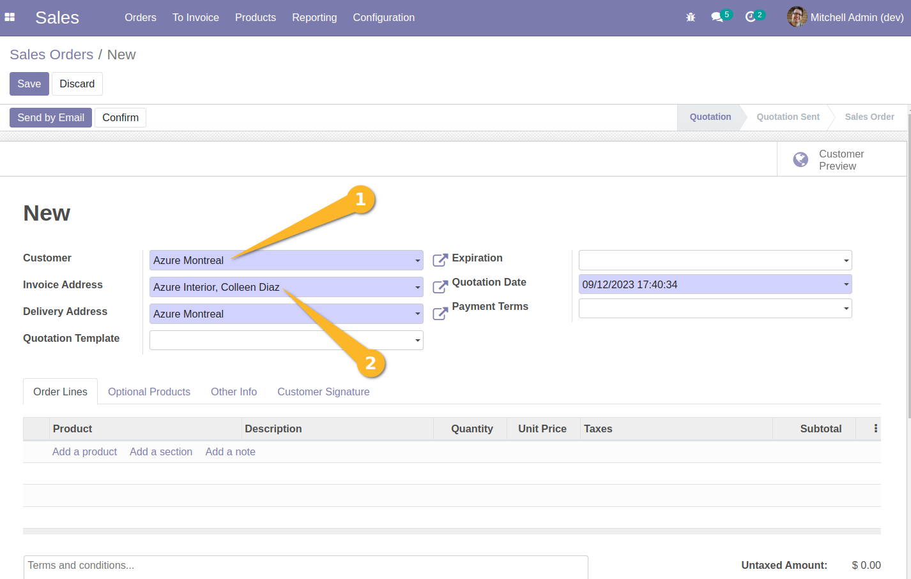

Partner Affiliate Invoicing Address
===================================

.. contents:: Table of Contents

Context
-------
The module `partner_affiliate <https://github.com/OCA/partner-contact/tree/12.0/partner_affiliate>`_
allows to define child commercial partners (affiliates) under a common parent entity.

By default, the invoicing address of each affiliate is used when selling to an affiliate.

Therefore, defining an invoicing address on the parent entity
has no impact on invoices of its affiliates.

Usage
-----
This module adds a checkbox ``Use Parent Invoice Address``.

When this box is checked, the invoicing address for this affiliate will be
selected from its parent entity.

Configurations and functionalities since version 1.0.1
------------------------------------------------------
As an internal user, I go to the form view of an `Affiliate`` (``Company`` type contact, child of a ``Company`` type contact).

From the ``Contacts & Addresses`` tab,
- I click on ``Use parent Invoice address``.
- I see that a new required field ``Invoice Address to use`` is displayed. 
The parent's billing address (vanilla behavior of the module) is entered as the default value.

I see that I can select:
- another invoice address of the parent company (Address Type = Invoice Address) 
- the main address of the parent company

As a Sales user, I create a sales order for customer ``Azure Montreal`` or one of its children.

I see that the invoice address selected is the invoice address defined previously.

Contributors
------------
* Numigi (tm) and all its contributors (https://bit.ly/numigiens)

More information
----------------
* Meet us at https://bit.ly/numigi-com
