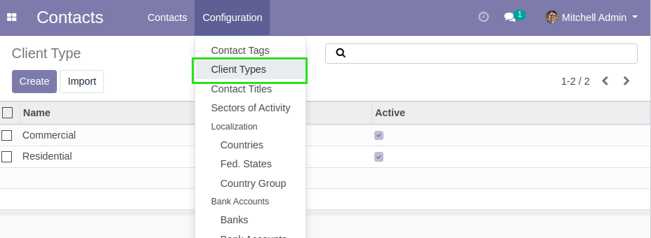
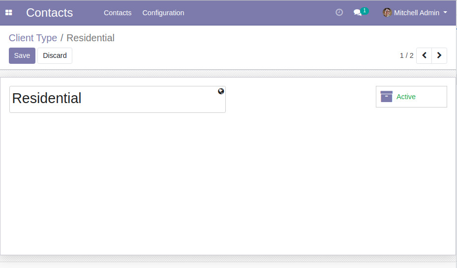
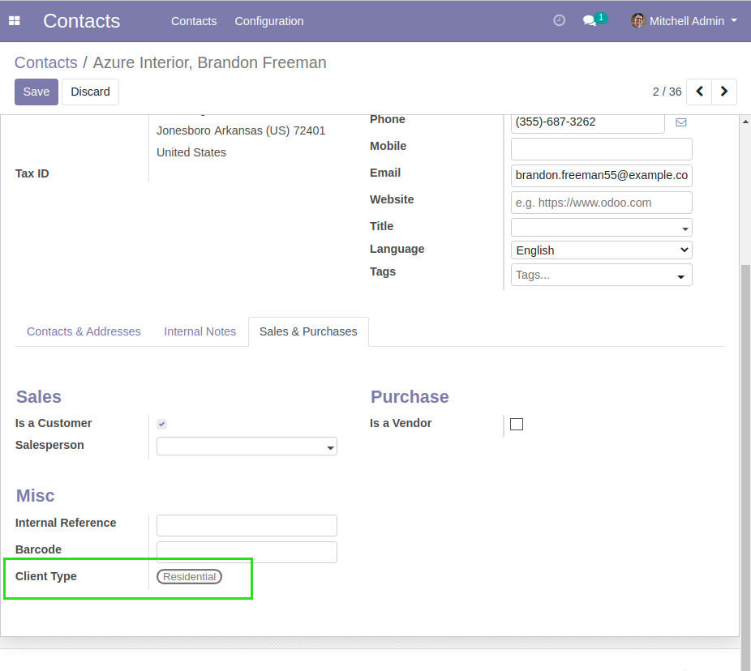

Partner Client Type
===================
This module adds client types to contacts.

.. contents:: Table of Contents

Usage
-----
In the configuration submenu of the contacts menu, you can now view client types.

You can then create a client type.

You can link that client type to a commercial partner.

The client type is automatically propagated to the contacts of this partner.

Configuration
-------------
No configuration is required after installation.

Contributors
------------
* Numigi (tm) and all its contributors (https://bit.ly/numigiens)

More information
----------------
* Meet us at https://bit.ly/numigi-com
