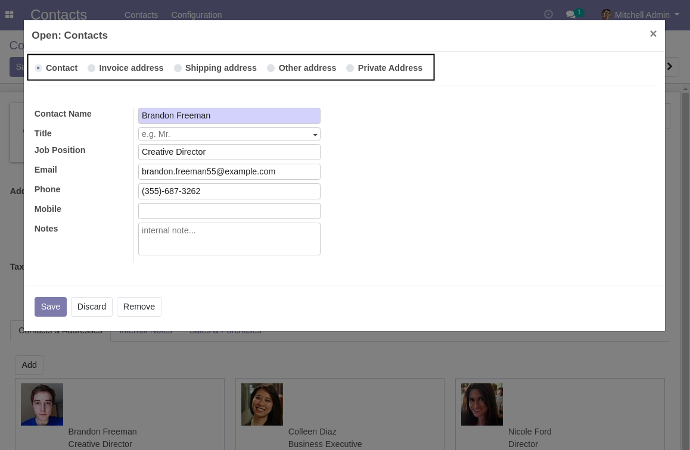
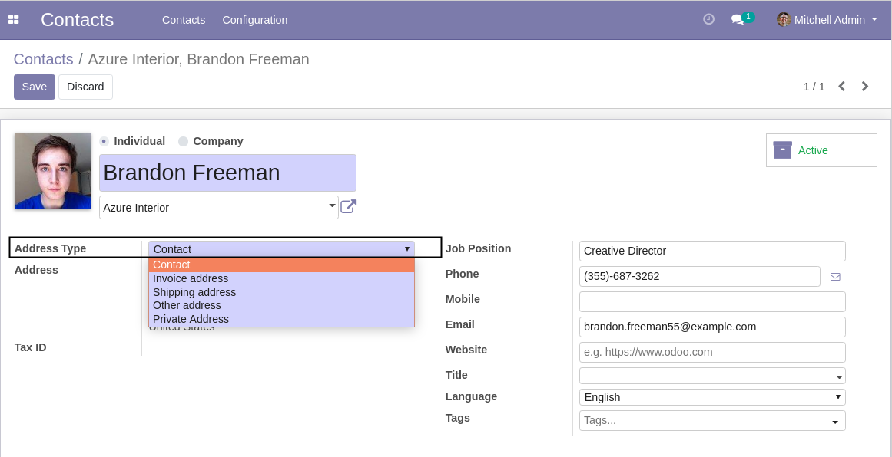
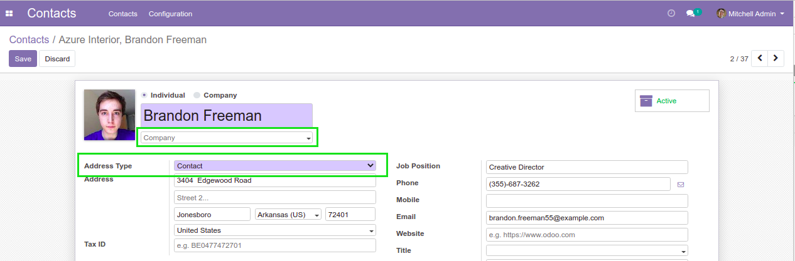
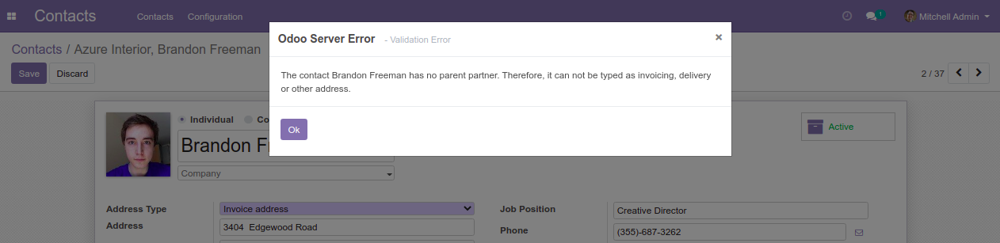

Partner Contact Type Visible
============================

.. contents:: Table of Contents

Context
-------
In vanilla Odoo, the contact type is only editable from the simplified contact view.

Overview
--------
This module makes the contact type visible on the form view of a partner.

The contact type is also visible if the contact has no parent.

This allows to define the contact as a ``Private Address``.

However, if you select ``Invoice``, ``Shipping`` or ``Other Address``, an error is raised
when saving if the contact has no parent.

Contributors
------------
* Numigi (tm) and all its contributors (https://bit.ly/numigiens)

More information
----------------
* Meet us at https://bit.ly/numigi-com
