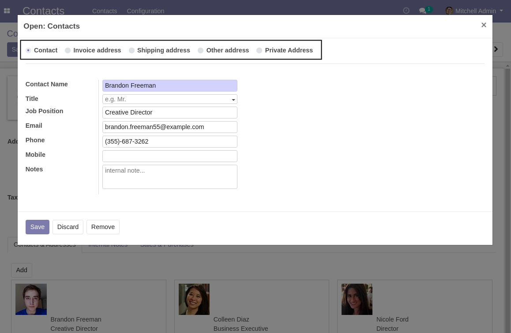
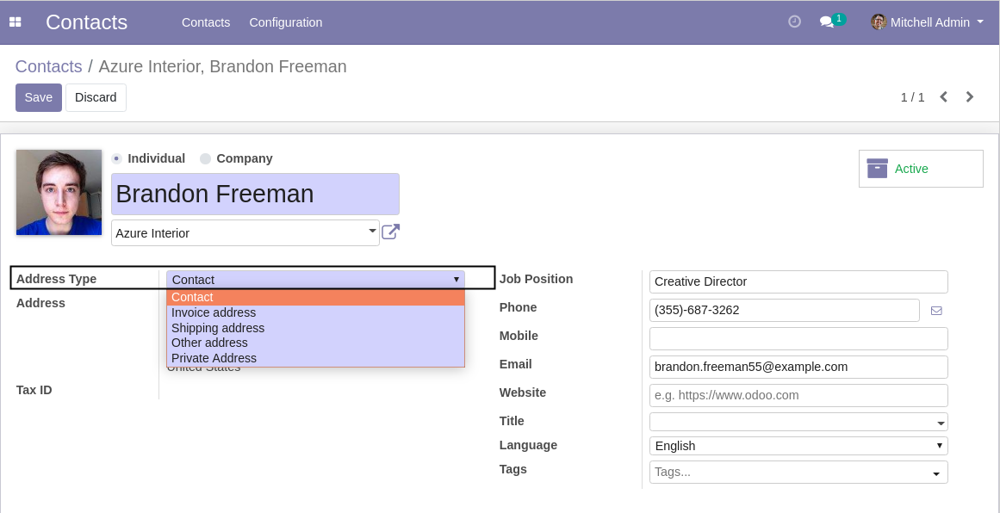
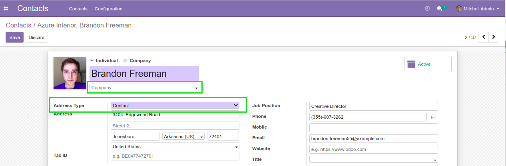

Partner Contact Type Visible
============================

.. contents:: Table of Contents

Context
-------
In vanilla Odoo, the contact type is only editable from the simplified contact view.

Overview
--------
This module makes the contact type visible on the form view of a partner.

The contact type is also visible if the contact has no parent.

This allows to define the contact as a ``Private Address``.

Contributors
------------

The `Numigi <https://numigi.com/r/home>`_ team is the contributor to this project. We help Quebec companies implement Odoo and Konvergo ERP.