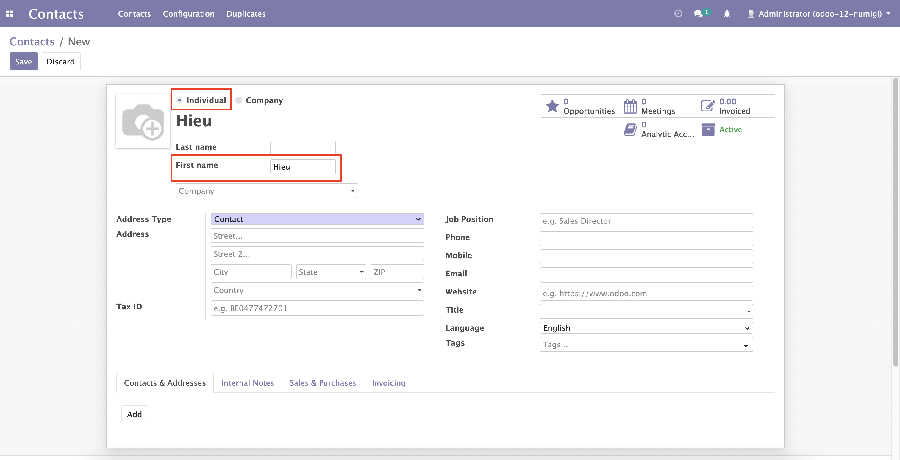
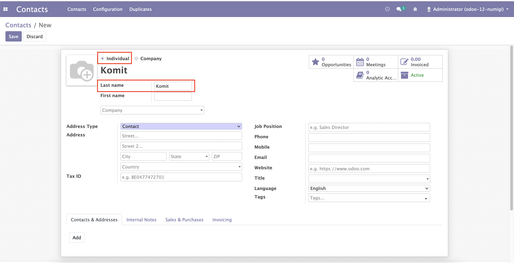
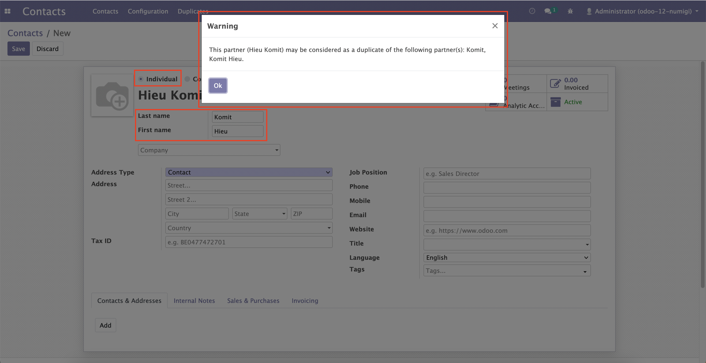
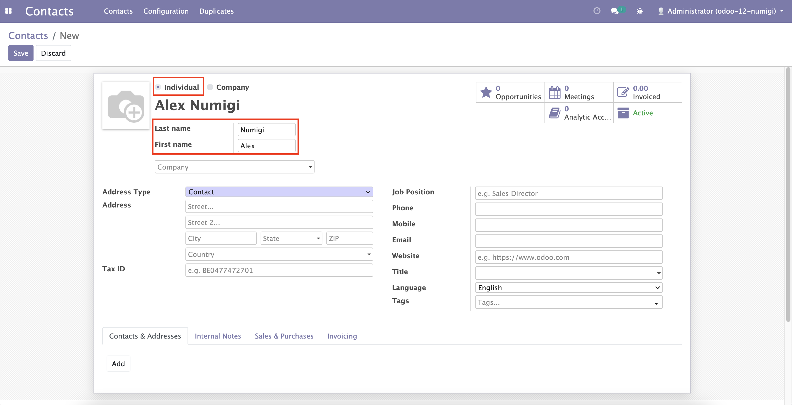
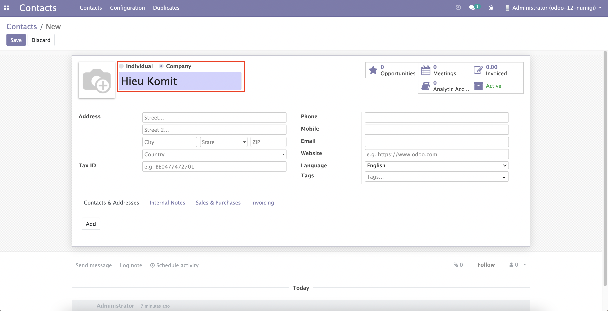

Partner Duplicate Management Firstname
======================================
Description
-----------

This module will adjust the time duplicated warning will be raised.

When input only First Name, no duplicated warning message.

When input only Last Name, no duplicated warning message.

When input both Last Name and First Name, duplicated warning message is raised when Odoo can find potential duplicated contact.

When input both Last Name and First Name, duplicated warning message is not raised when Odoo can not find any potential duplicated contact.

When select company type, no duplicated warning message.

Configuration
-------------

No configuration required apart from module installation.

Contributors
------------
* Numigi (tm) and all its contributors (https://bit.ly/numigiens)
* Komit (https://komit-consulting.com)

More information
----------------
* Meet us at https://bit.ly/numigi-com
