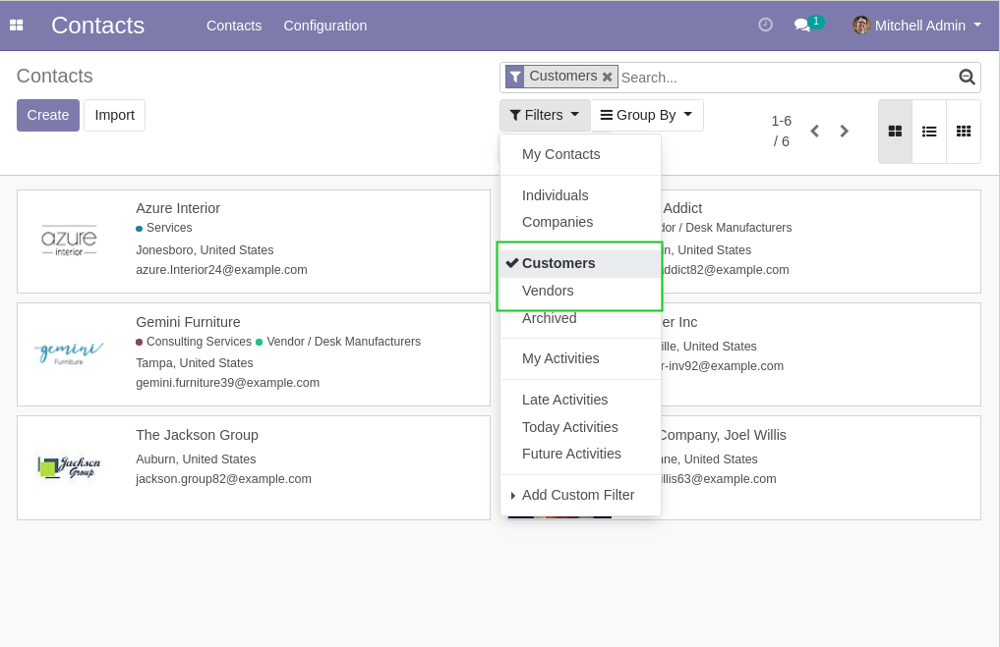
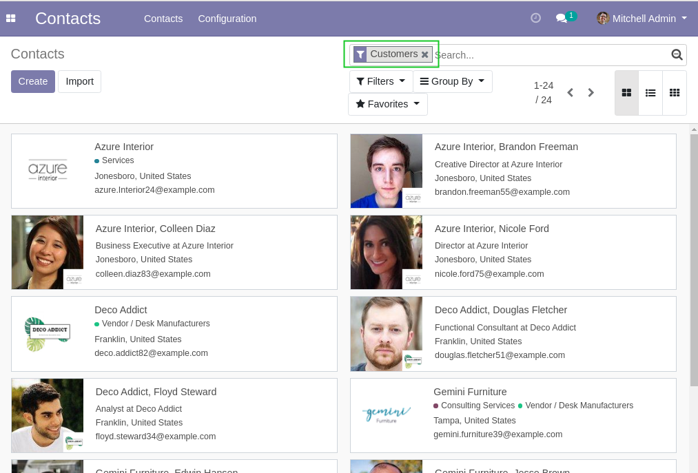

Partner Filters Simplified
==========================
This module simplifies the ``Customers`` and ``Suppliers`` filters on the list view of partners.

.. contents:: Table of Contents

Context
-------
Odoo comes by default with 2 filters ``Customers`` and ``Suppliers`` on partners.

These filters hide contacts and addresses (they only show partners with no parent).

Usage
-----
After the installation, the two filters show all customers or suppliers.

Contributors
------------

* The `Numigi <https://numigi.com/r/home>`_ team is the contributor to this project. We help Quebec companies implement Odoo and Konvergo ERP.
