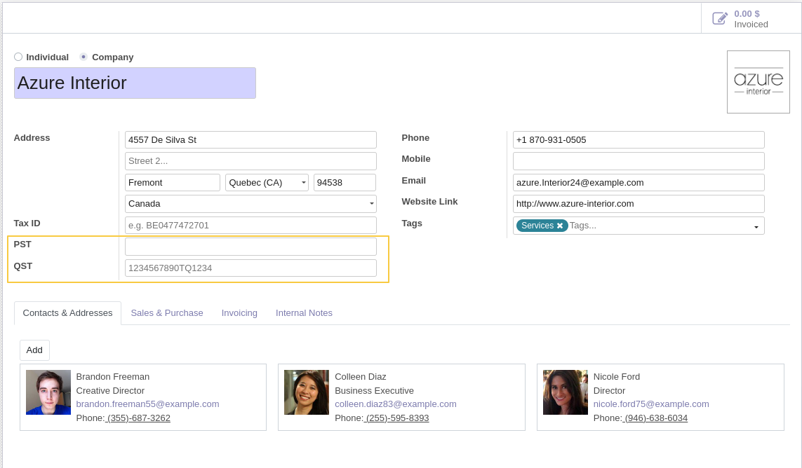

Partner GST QST
===================

This module allows to manage GST and QST numbers.

Usage
-----

On the form view of partner,  two fields ``PST`` and  ``QST`` are added.

Since the version 1.0.1, the module depends of `l10n_ca` and add condition to display ``PST`` and  ``QST`` only if the country is Canada.
The module also hide the field ``VAT`` id the country is Canada.

Contributors
------------
* Numigi (tm) and all its contributors (https://bit.ly/numigiens)
