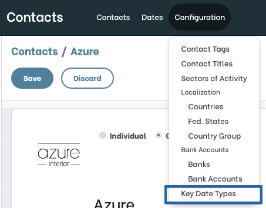
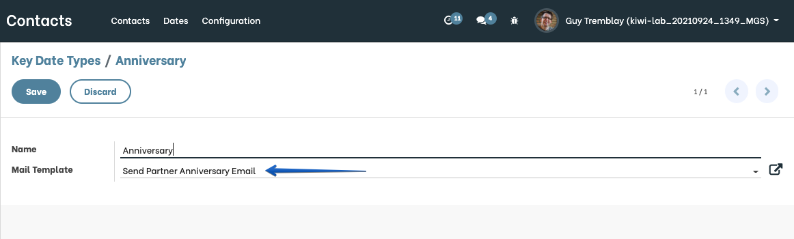
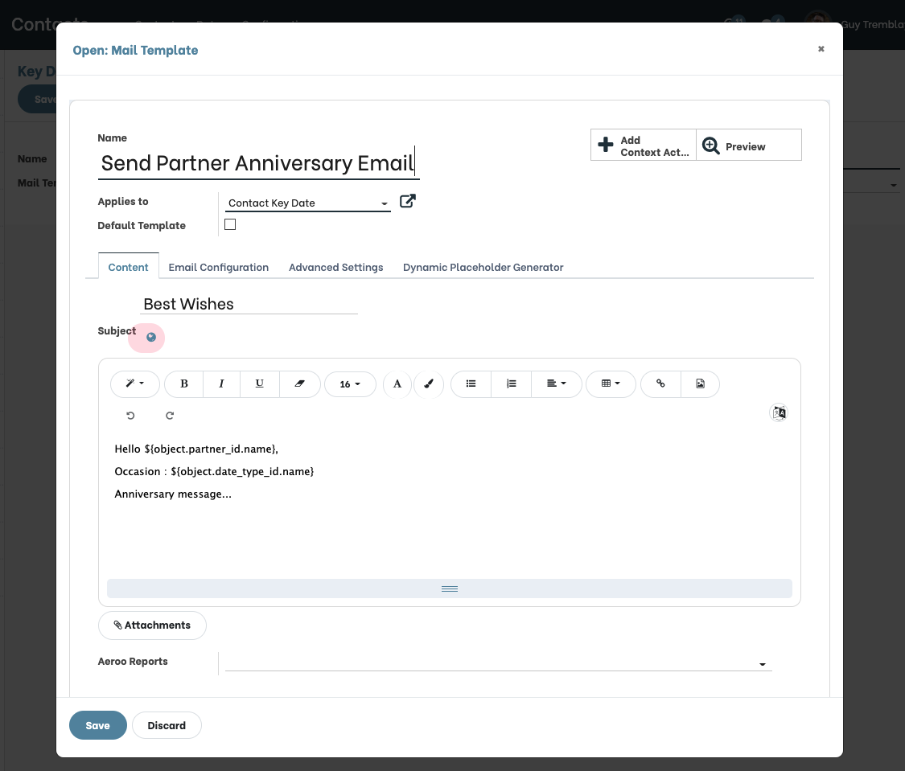
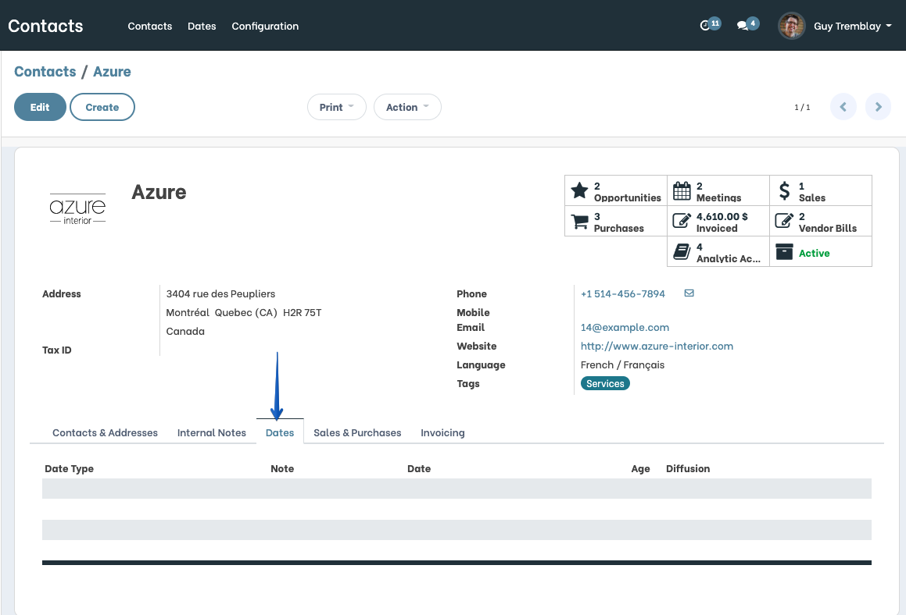
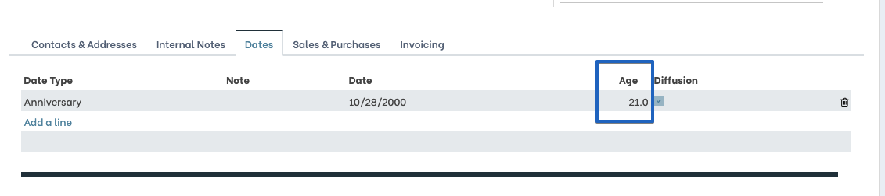
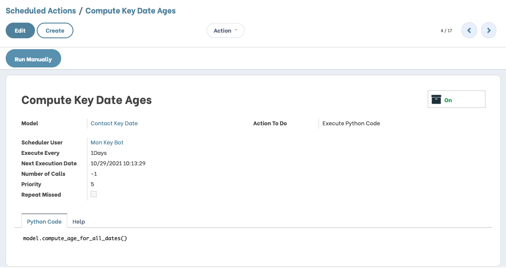
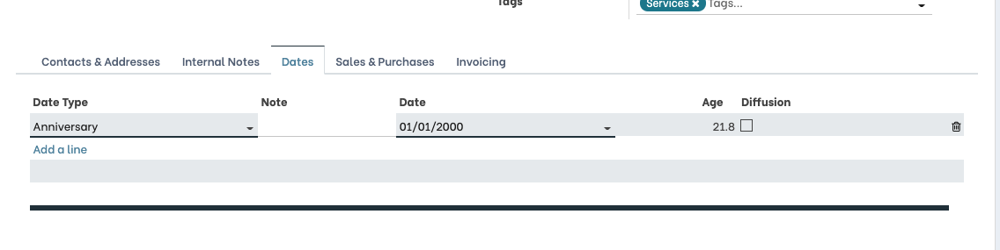
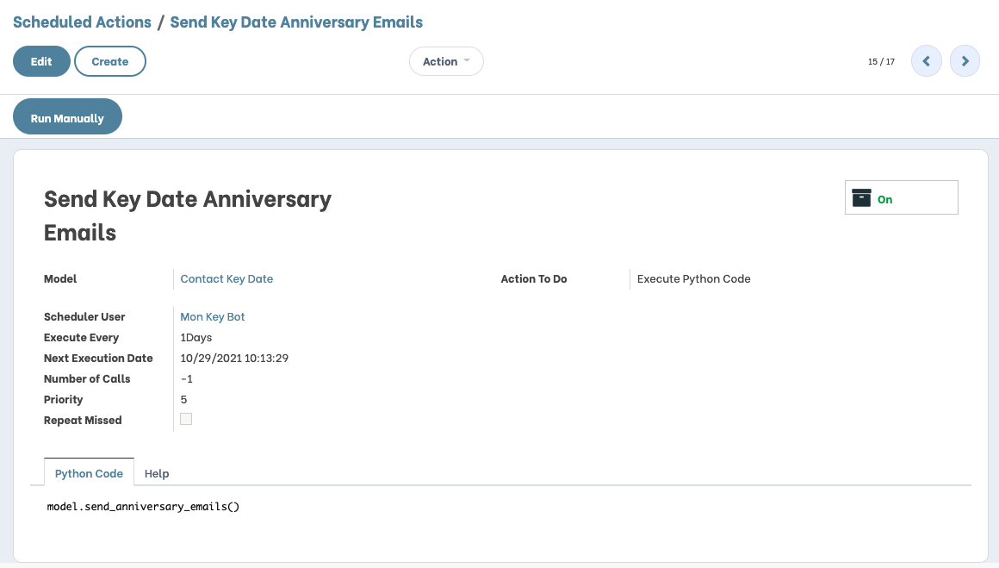
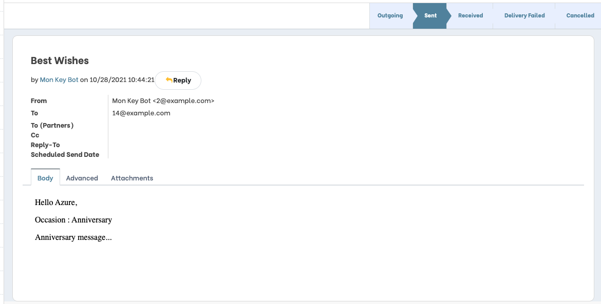

Partner Key Dates
=================
This module adds key dates on partners.

A key date is an important event in the timeline of a contact.

Configuration
-------------------

Multiple date types can be configured under the menu Contacts / Configuration / Key Date Types.

These types will be available in the key date section on the partner.

On the Key Date Type, it is possible to set an email template that will be sent on the date anniversary.

A "Send Partner Anniversary Email" is available by default with the module.

Usage
-------------------

Key dates can be accessed from Contacts / Dates.

The colomn "Age" is automatically computed from the key Date. The computation is done when saving the form view.

...or with a daily cron.

The column "Diffusion" allows to check dates for which an email
must be sent at the anniversary of a key date.

Anniversary Emails
------------------
The modules adds a cron to send an email on the anniversary of a key date.

At anniversary, if the "Diffusion" option is activated on the date, an email is sent.

Contributors
------------
* Numigi (tm) and all its contributors (https://bit.ly/numigiens)
* Savoir-faire linux

More information
----------------
* Meet us at https://bit.ly/numigi-com
