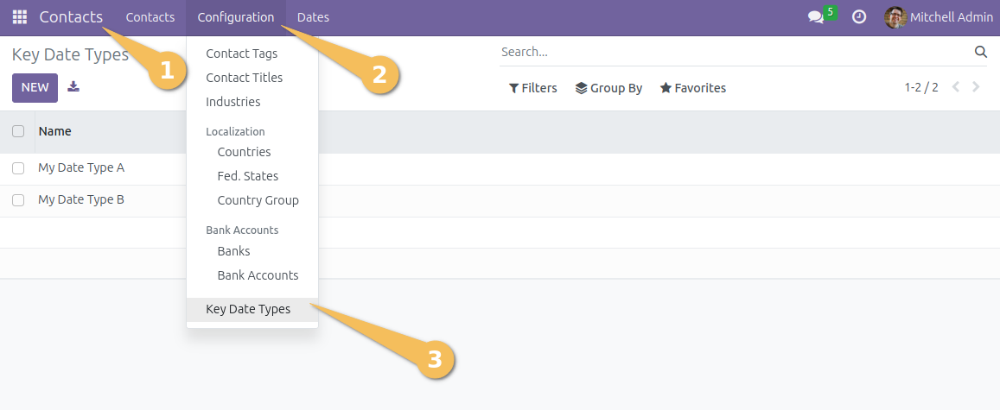
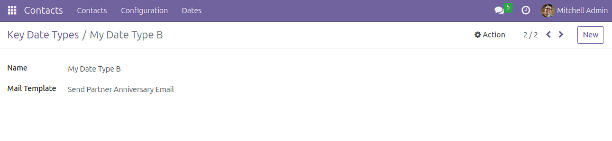
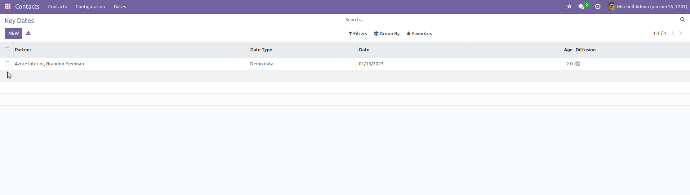
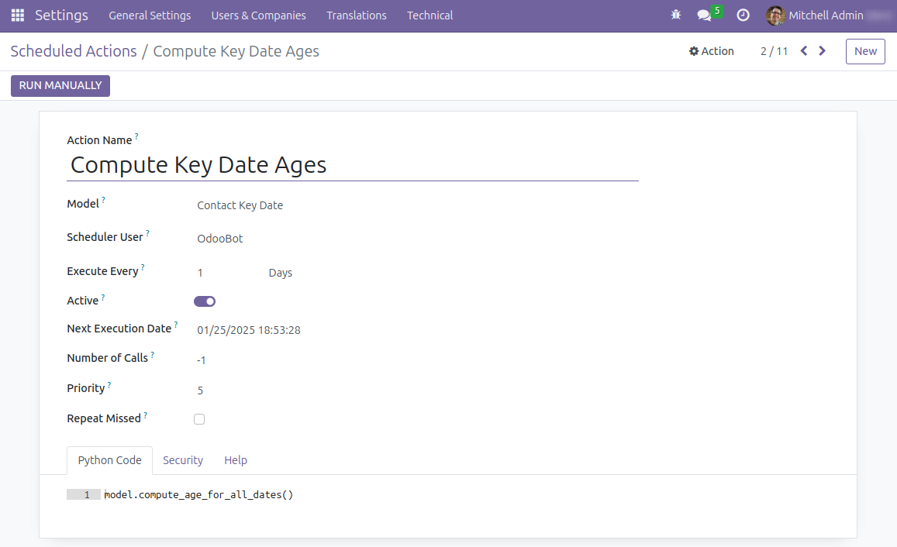
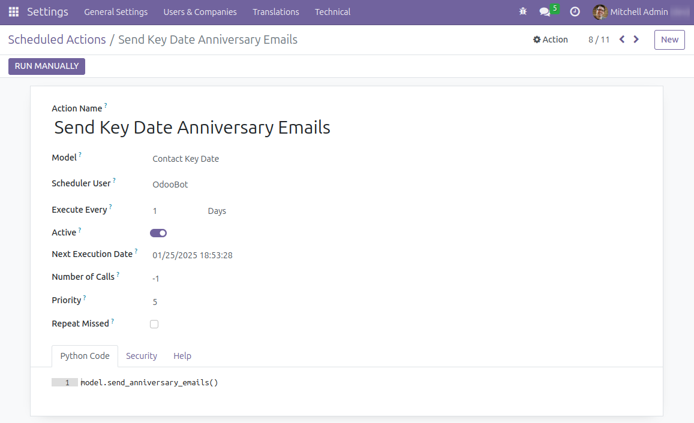

Partner Key Dates
=================
This module adds key dates to partners.

A key date is an important event in the timeline of a contact.

Key dates require a type, and these types are configurable. 
To configure key date types, go to `Contacts / Configuration / Key Date Types`.

Key dates can be accessed from Contacts / Dates.

Age Calculation
---------------
The module includes a cron job to calculate and update the age associated with key dates.
This cron ensures that the age field is kept up-to-date.

Anniversary Emails
------------------
The module also adds functionality to send emails on the anniversary of key dates.

In the list view of key dates, the column `Diffusion` allows you to specify which dates should trigger an email on their anniversary.

A scheduled action (cron) is responsible for sending these emails to the relevant contacts.

Contributors
------------
* Numigi (tm) and all its contributors (https://bit.ly/numigiens)
* Savoir-faire Linux

More Information
-----------------
* Meet us at https://bit.ly/numigi-com
