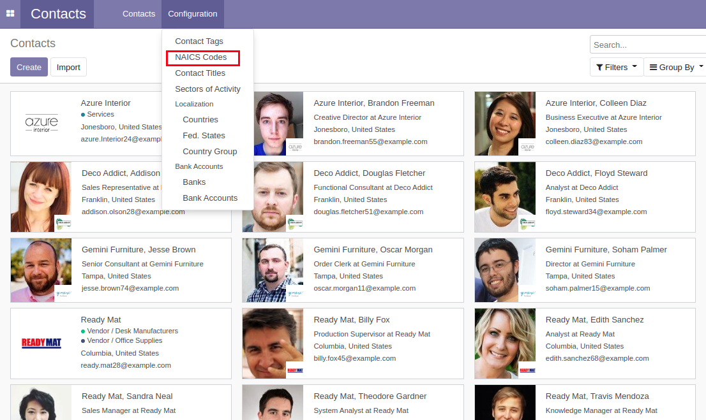
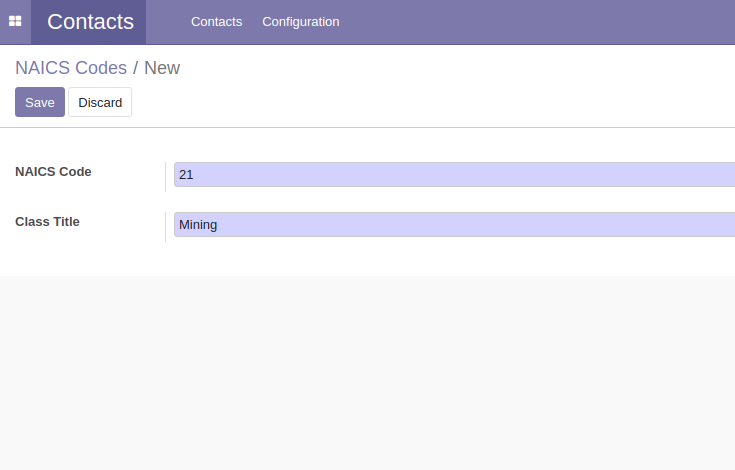
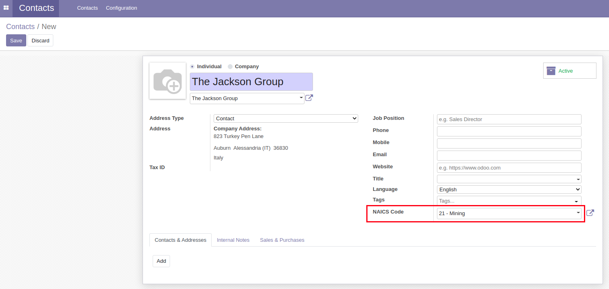

Partner NAICS Code
==================
This module adds a NAICS code creation menu in the contacts menu, while also allowing NAICS code selection during partner creation.

.. contents:: Table of Contents

Usage
-----
There is now a NAICS code creation menu in the configuration dropdown menu of the contacts module.

Users with the Contact Creation group can create an NAICS code.

You can select an NAICS code when creating a partner (contact).

Configuration
-------------
No configuration is required after installation.

Contributors
------------

The `Numigi <https://numigi.com/r/home>`_ team is the contributor to this project. We help Quebec companies implement Odoo and Konvergo ERP.