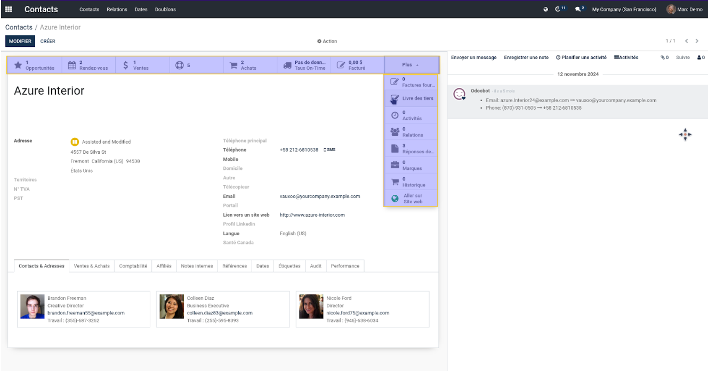

Partner Read Access Actions
===========================

Context:
--------

Based on the `base_extended_security <https://github.com/Numigi/odoo-base-addons/blob/14.0/base_extended_security/README.rst#action-buttons>`_ module,

when a user has only read access to a specific model due to a Basic Rule, the action buttons on the form view are hidden.

After addons extended rule on Partner , users with only Read access to Partner will not see stock action buttons.

To allow these users to view the action buttons, we have added a hook provided by the `base_extended_security` module.

Description:
------------

As a user with read access to a Partner , I can now see the stock Smart Buttons on the form view of a Partner. 

I display the form view of a Partner, I am now able to see and click on the stock Smart Buttons.

Contributors
------------
* Numigi (tm) and all its contributors (https://bit.ly/numigiens)

More information
----------------
* Meet us at https://bit.ly/numigi-com
