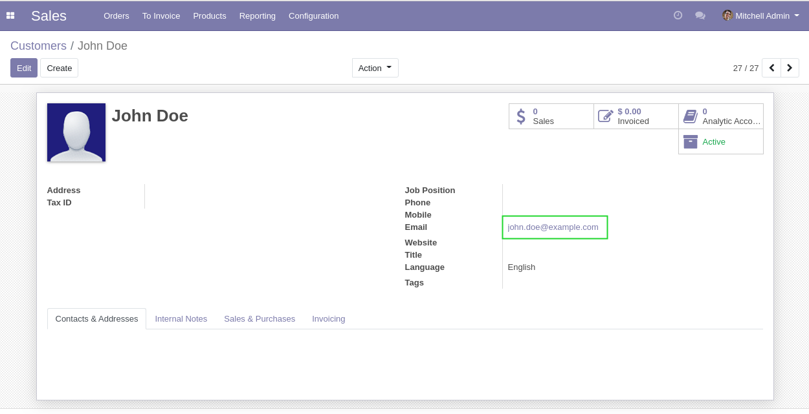
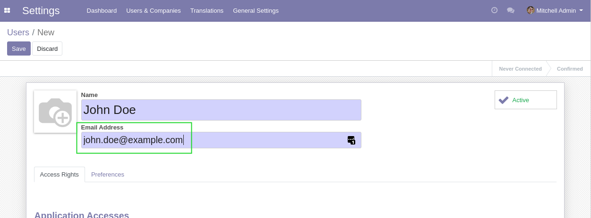
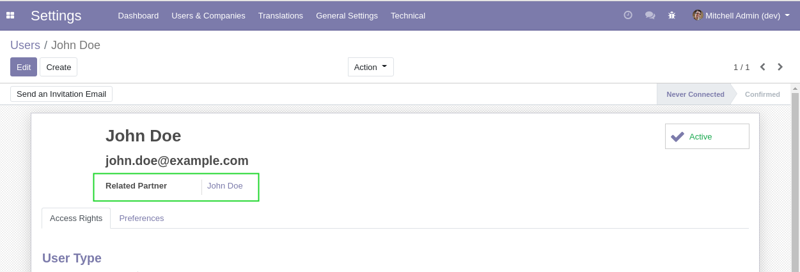
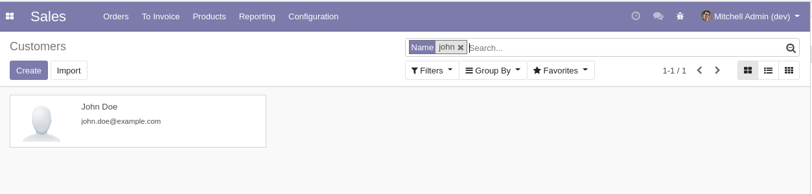

Partner User Auto Assign
========================

Context
-------
The module ``partner_unique_email`` prevents to have two partners with the same email address.

However, when creating a user with a given email address without setting a partner,
a partner is automatically created. Then a blocking error message is raised.

Overview
--------
After installing this module, when creating a user, an existing partner matching the email address
is automatically assigned to the new user.

If no matching partner is found, then a partner is created.

Usage
-----
I create a partner with a given email address.

I create a user with the same email address.

After saving the user form, I notice that the existing partner was automatically assigned to it.

This can be easily verified by checking that only one partner matches the given name.

Contributors
------------
* Numigi (tm) and all its contributors (https://bit.ly/numigiens)

More information
----------------
* Meet us at https://bit.ly/numigi-com
