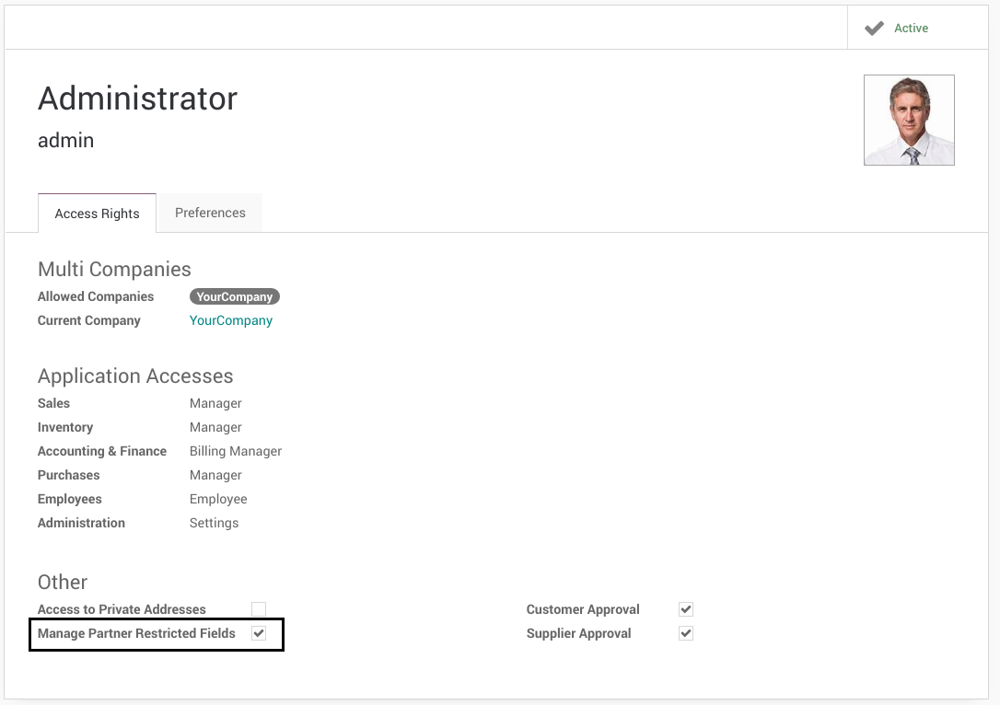
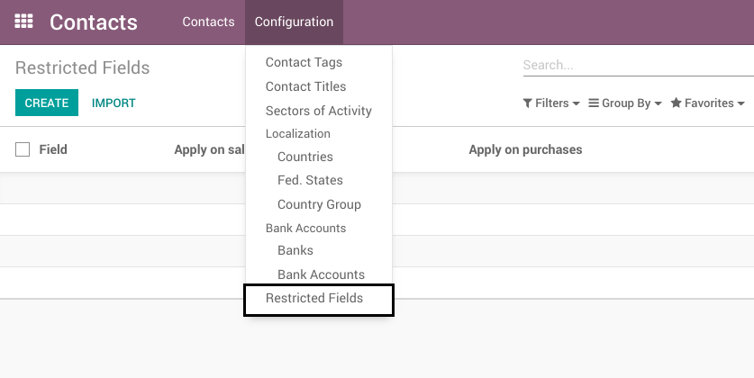
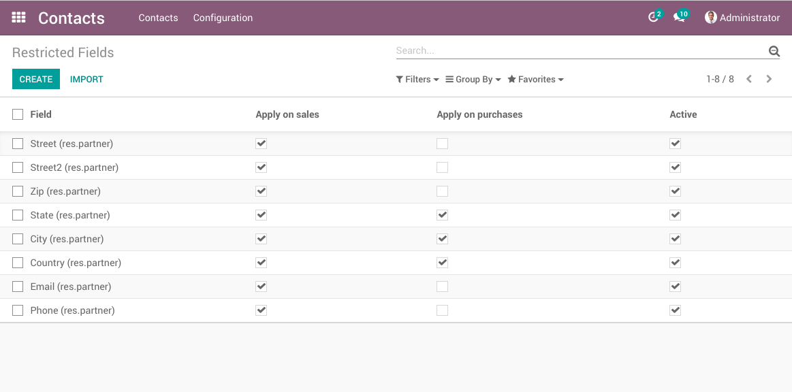

Partner Validation
==================
This module is the base for validating suppliers and customers.

The following extensions enable the feature for the purchase and sale workflows respectively:

* `partner_validation_purchase`: https://github.com/Numigi/odoo-partner-addons/tree/11.0/partner_validation_purchase
* `partner_validation_sale`: https://github.com/Numigi/odoo-partner-addons/tree/11.0/partner_validation_sale

Partner Restricted Field Group
------------------------------
A new group `Manage Partner Restricted Fields` is added.

Restricted Fields
-----------------
A restricted field is a field that can not be edited once a supplier or customer is approved.

The list of restricted fields can be found under Contacts / Configuration / Restricted Fields.

It is only editable by members of the group `Manage Partner Restricted Fields`.

Contributors
------------
* Numigi (tm) and all its contributors (https://bit.ly/numigiens)
* Akretion

More information
----------------
* Meet us at https://bit.ly/numigi-com
