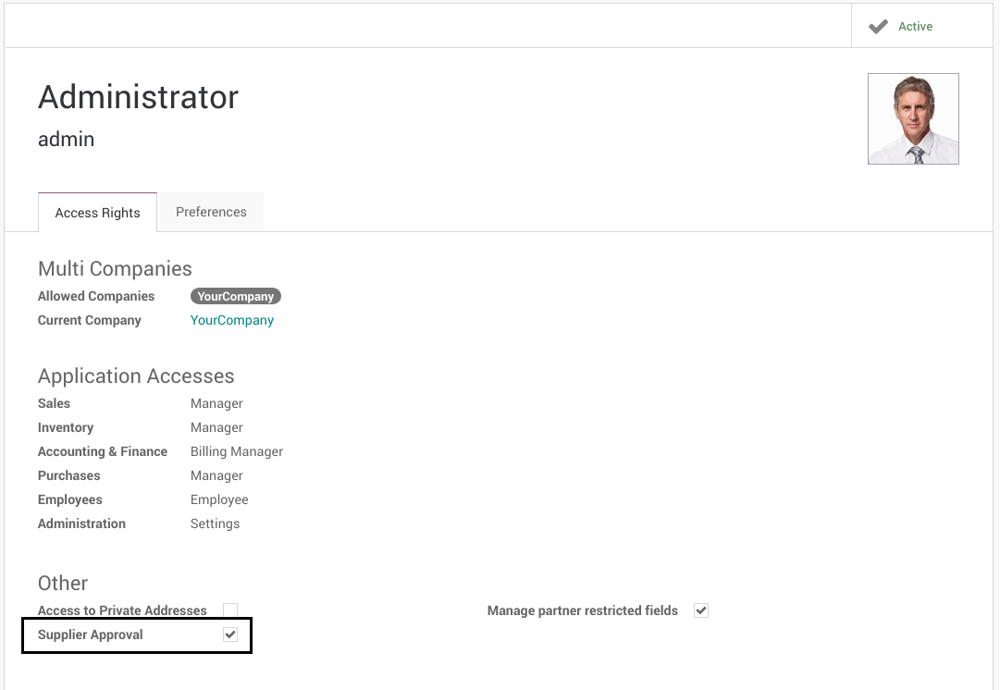
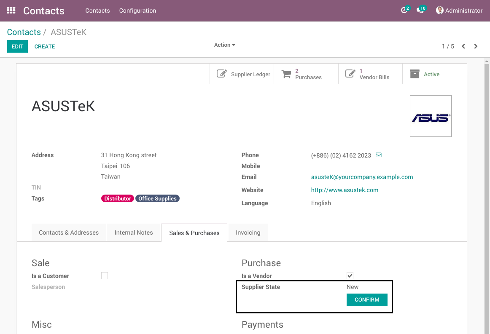
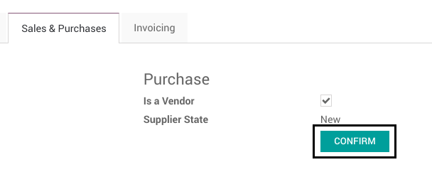
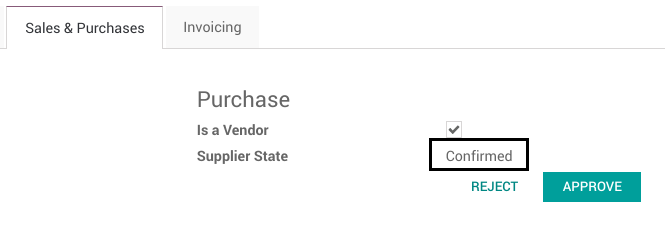
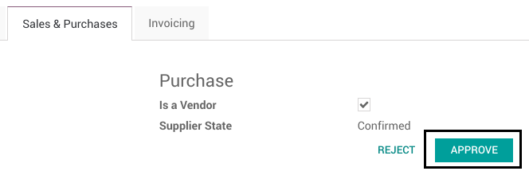
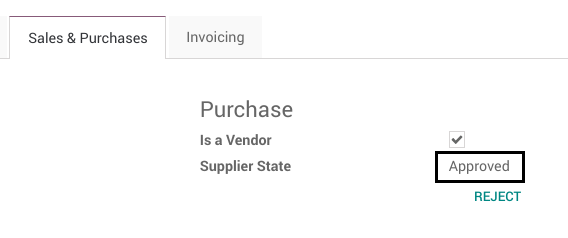
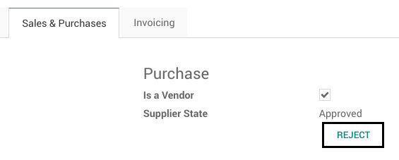
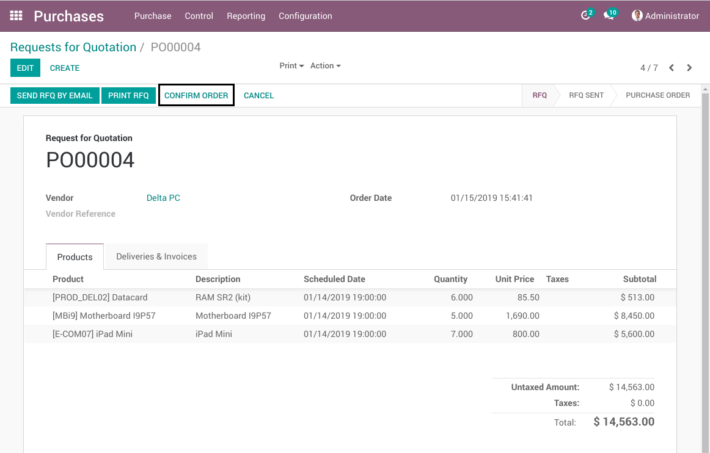
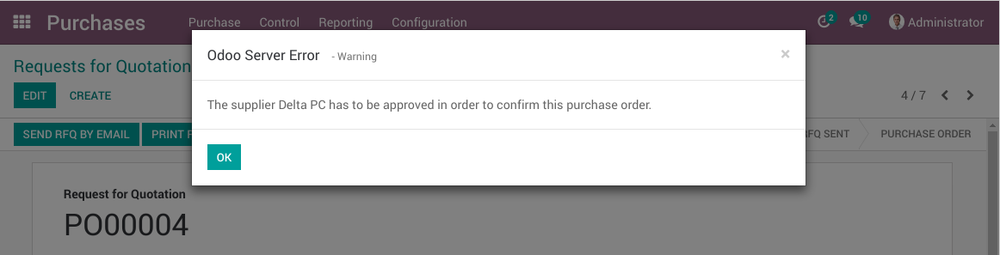

Partner Validation Sale
=======================
This module adds a supplier validation workflow.
A supplier needs to be approved before any purchase order is confirmed.

Supplier Approval Group
-----------------------
A new group `Supplier Approval` is added.

This group allows to approve a partner as a supplier.

Supplier State
--------------
In the form view of a partner, a new field `Supplier State` is added.

This field has 3 values:

* New
* Confirmed
* Approved

It is only visible if the partner is a supplier.
It is only visible on a commercial partner (i.e. it is not visible on a contact or a billing address).

Confirm
~~~~~~~
The `Confirm` button changes the supplier state to `Confirmed`.

Any user with write access to the partner can click on the button.

Approve
~~~~~~~
The `Approve` button changes the supplier state to `Approved`.

Only members of the group `Supplier Approval` can click on the button.
The button is invisible for other users.

Reject
~~~~~~
The `Reject` button changes the supplier state to `New`.

.. image:: static/description/partner_form_new.png

Any user with write access to the partner can click on the button.

Purchase Order Confirmation
---------------------------
When confirming a request for quotation, if the commercial partner related to the supplier is not approved
as a supplier, a blocking message is shown to the user.

The supplier must be approved by a member of the `Supplier Approval` Group before
confirming the purchase order.

Contributors
------------
* Numigi (tm) and all its contributors (https://bit.ly/numigiens)
* Akretion

More information
----------------
* Meet us at https://bit.ly/numigi-com
