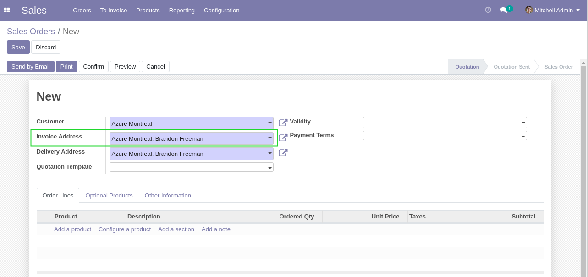
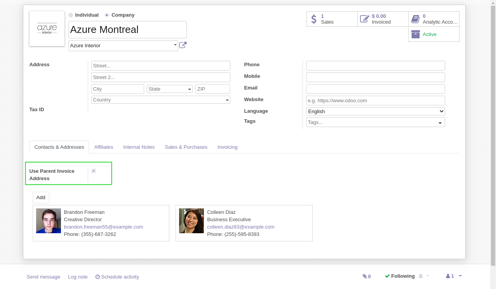

Partner Affiliate Invoicing Address
===================================

.. contents:: Table of Contents

Context
-------
The module `partner_affiliate <https://github.com/OCA/partner-contact/tree/12.0/partner_affiliate>`_
allows to define child commercial partners (affiliates) under a common parent entity.

By default, the invoicing address of each affiliate is used when selling to an affiliate.

Therefore, defining an invoicing address on the parent entity
has no impact on invoices of its affiliates.

Usage
-----
This module adds a checkbox ``Use Parent Invoice Address``.

When this box is checked, the invoicing address for this affiliate will be
selected from its parent entity.

Contributors
------------
* Numigi (tm) and all its contributors (https://bit.ly/numigiens)

More information
----------------
* Meet us at https://bit.ly/numigi-com
