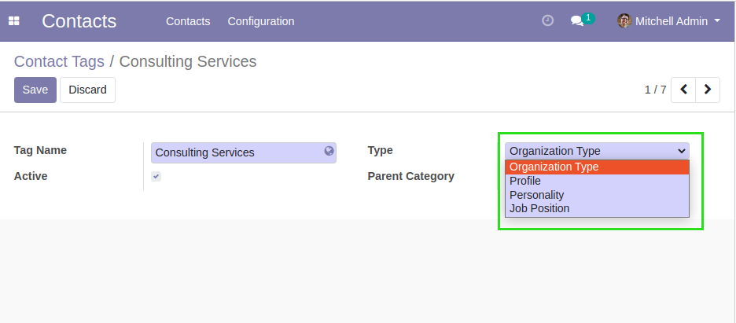
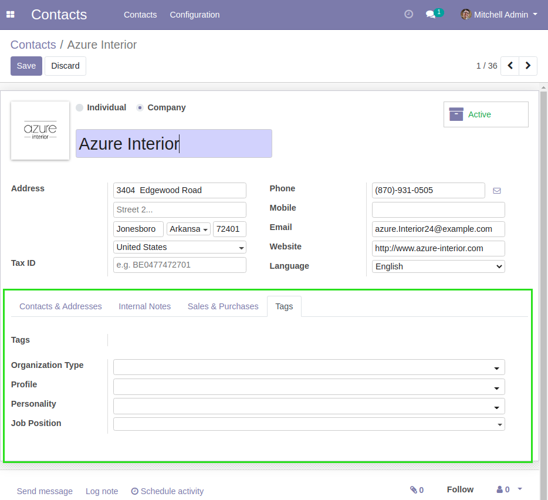
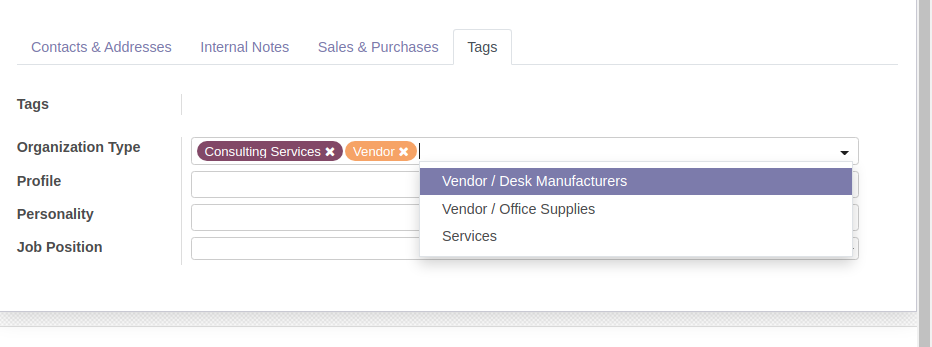
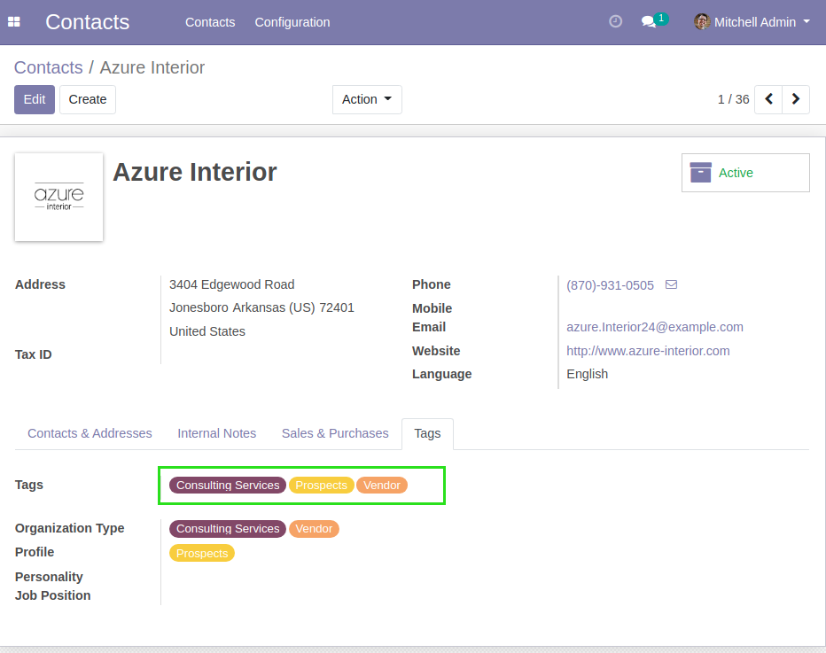
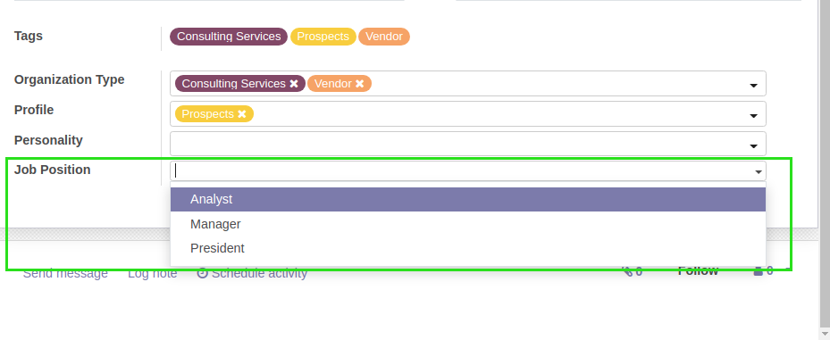

Partner Category Type
=====================

.. contents:: Table of Contents

Overview
--------
This module splits the partner categories (tags) into 4 different types.

* Organization Type
* Profile
* Personnality
* Job Position

Configuration
-------------
In the form view of a category type, I find a new field ``Type``, allowing
to select one of the 4 types.

Usage
-----
I go to the form view of a partner.

I notice that the tags have been moved into a new tab.

The field ``Tags`` is readonly.

Below this field, 4 fields allow to select tags of a given type.

After saving, the field ``Tags`` is filled based on these fields.

Job Position
~~~~~~~~~~~~
This field ``Job Position`` only allows to select a single partner category.

The three other fields allow to select multiple categories.

Contributors
------------
* Numigi (tm) and all its contributors (https://bit.ly/numigiens)
* Yasmine El Mrini (yasmine.elmrini@savoirfairelinux.com)

More information
----------------
* Meet us at https://bit.ly/numigi-com
