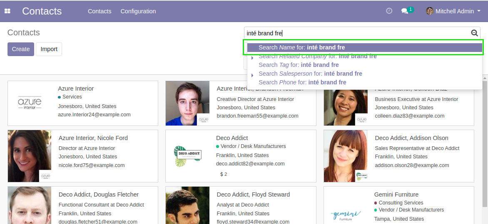
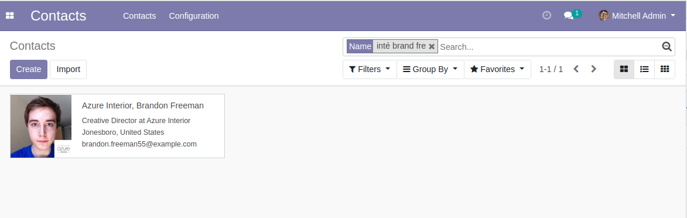
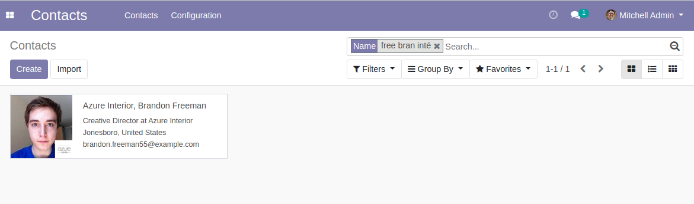
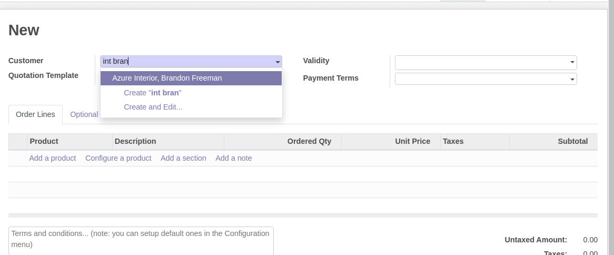
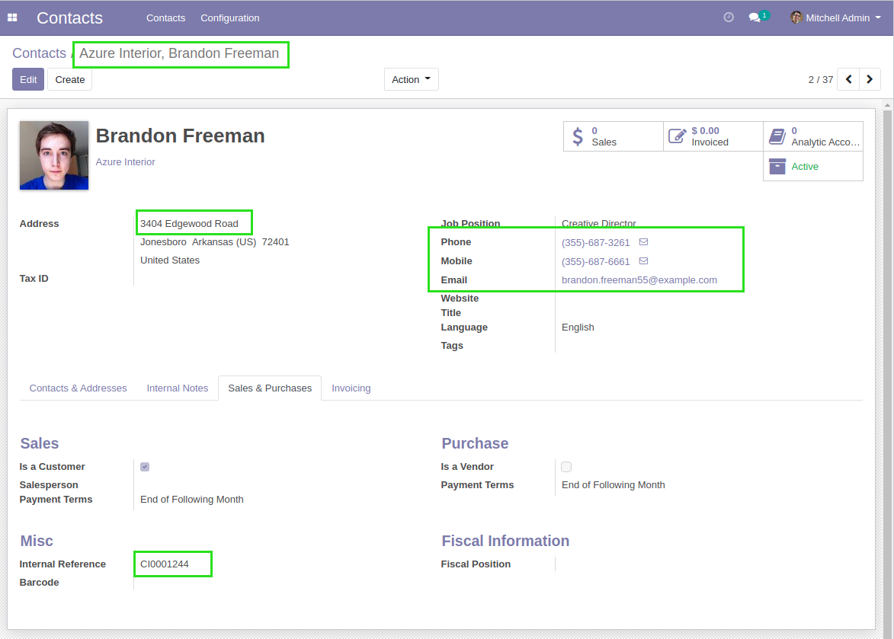

Partner Full Text Search
========================
This module adds full text search on partners.

.. contents:: Table of Contents

Context
-------
``Partners`` are one of the object types that is the most intensively searched through
the web interface by users.

When searching a contact, there are multiple fields that you might want to search,
including, the phone number, the email, the address, etc.

You might mispell the word you are searching.

In french, you might miss an accent on a given word.

In vanilla Odoo, you may end up rewriting your expression multiple times before
finding what you are searching for.

Dependencies
------------
This module depends on `base_search_fuzzy <https://github.com/OCA/server-tools/tree/12.0/base_search_fuzzy>`_.

The later allows to easily define trigram indexes.

It also allows to search using the similarity operator ``%`` in search domains.

How The Module Works
--------------------
The module defines a new column ``full_text`` on partners.

The new column is filled with words from other columns of ``res.partner``.

Then, it uses the operator ``like`` (rather than the similarity operator ``%``) to search
in this new column.

..

    The problem with the similarity operator ``%`` is that it does not
    perform well when comparing a small expression with a larger expression.

The column ``full_text`` stores words with a couple adjustments:

* Accents and dots (``.``) are removed
* Words with hyphens (``-``) are stored with and without the hyphen.

Configuration
-------------
The module does not require particular configuration.
The partners are automatically indexed at installation.

Usage
-----
I go to the kanban view of partners.

In the search box, I type an expression containing:

* A part of word from a commercial partner
* Two parts of words from a contact

The contact is found.

I reverse the words and the result will be the same.

Inside a many2one field, I can search partners the same way.

Indexed Fields
--------------
The following fields are indexed by the module:

* Display Name
* Email
* Phone and Mobile
* Street (both lines)
* Reference

Contributors
------------
* Numigi (tm) and all its contributors (https://bit.ly/numigiens)

More information
----------------
* Meet us at https://bit.ly/numigi-com
