Partner Change Parent
=====================

.. contents:: Table of Contents

Summary
-------
This module adds a button in the partner form view for changing the parent entity of a contact.

Changing a parent entity is a complex operation. The contact may not be merely reassigned
to a different entity, because all documents created under the previous entity will follow
the contact under the next entity.

For example, customer invoices emited in regard to a given entity must not be reassigned to another entity.

Usage
-----
I go to the form view of a contact.

I notice that I the parent entity is readonly.

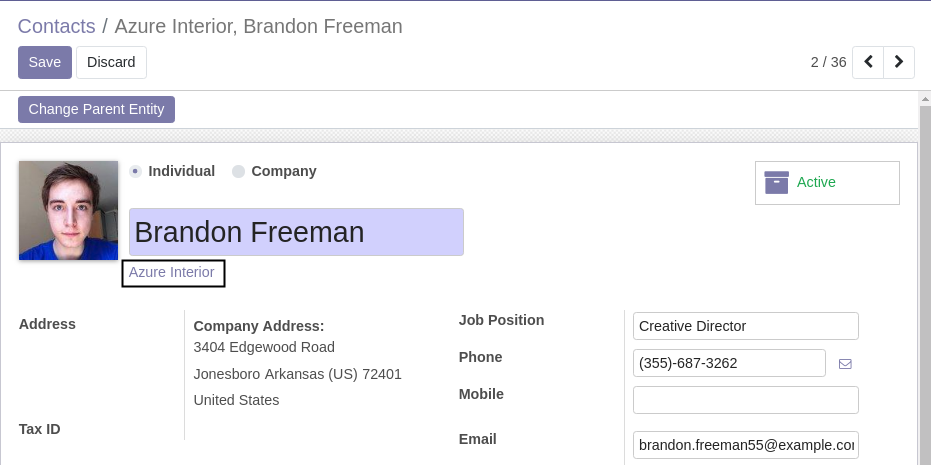

I also notice a new button ``Change Parent Entity``.

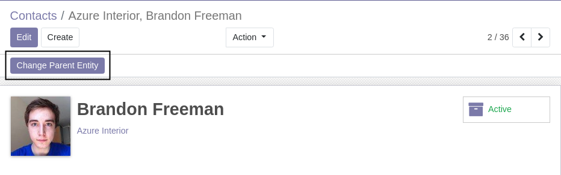

I click on the button. A wizard is opened, asking me to select a new parent for the contact.

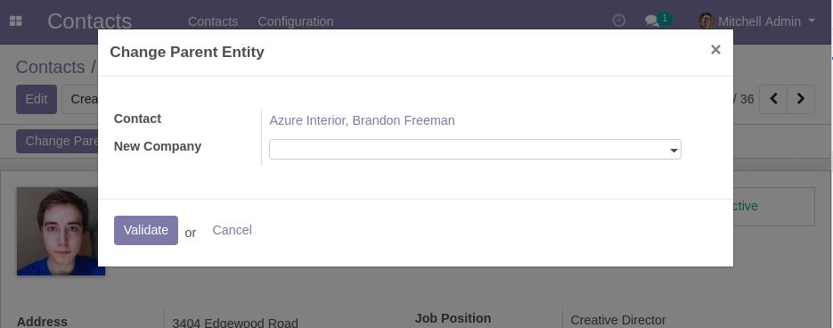

I select a new parent, then I click on ``Validate``

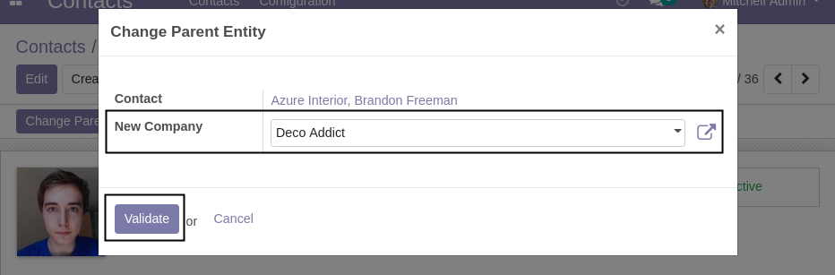

The form view of a copy of my contact is opened. This contact has the new parent entity.

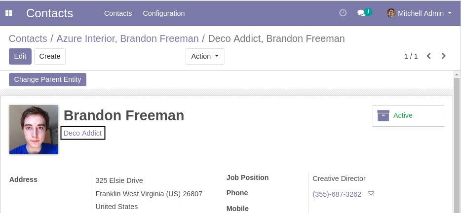

Using the breadcrumb, I can go back to the original contact.

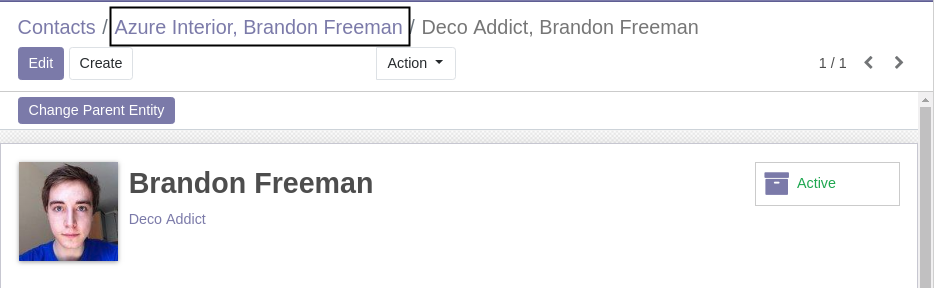

I notice that the original contact is archived.

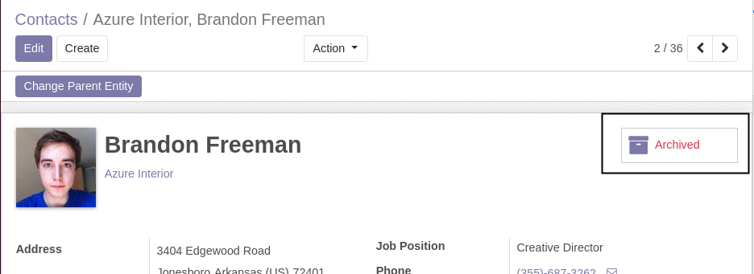

Correction Of The Parent Company
--------------------------------
Since version ``1.1.0`` of the module, a new checkbox appears on the wizard.

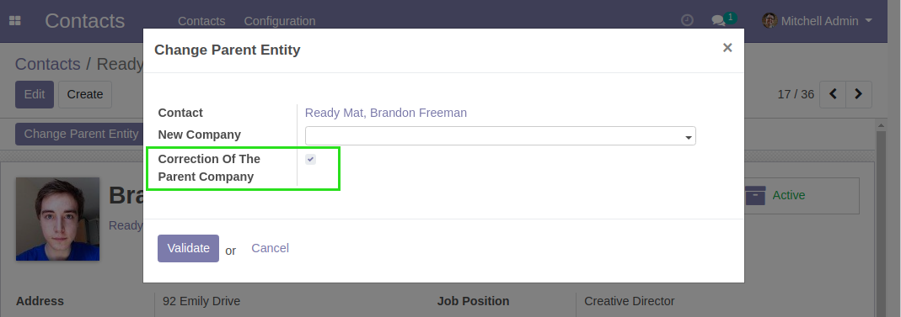

When the box is checked, instead of archiving the contact and creating a new contact,
the company is directly changed on the contact.

By default, the box is checked.

If you uncheck the box, a warning message is displayed.

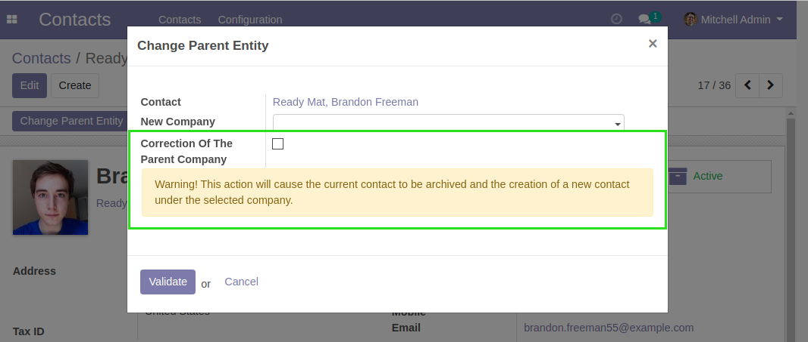

Most time, when the company needs to be changed on a contact, it is because the company was wrongly filled.
The cases where a contact moves to another company are less frequent.

This mecanism was instored to prevent polluting the database with multiple
duplicates of the same contact.

How the module works
--------------------
The following procedure is applied for changing a contact from an entity to another.

* The contact is copied.
* The copy is placed under the destination entity.
* The old contact is archived.

Portal Users
------------
If the partner is bound to an active portal user, when changing the parent entity,
a blocking message will be raised.

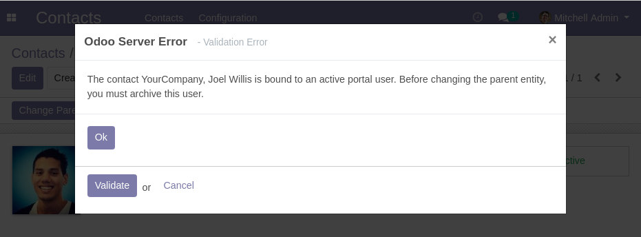

Before changing the parent, you must go to the form view of the portal user and archive this user.

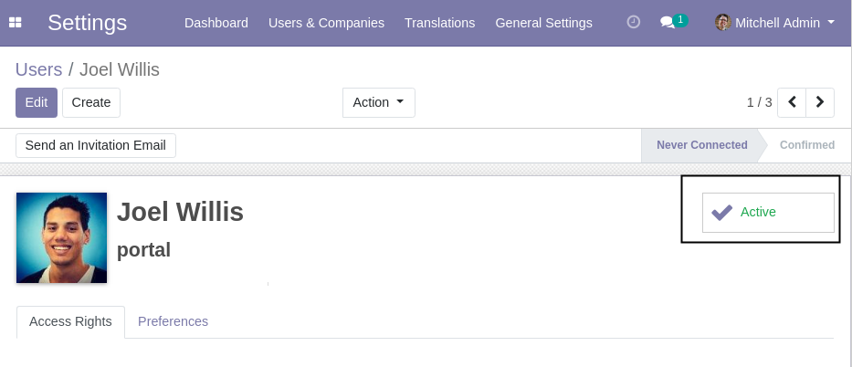

Contributors
------------
* Numigi (tm) and all its contributors (https://bit.ly/numigiens)
* Agathe Mollé (agathe.molle@savoirfairelinux.com)
* Guillaume Lot

More information
----------------
* Meet us at https://bit.ly/numigi-com
