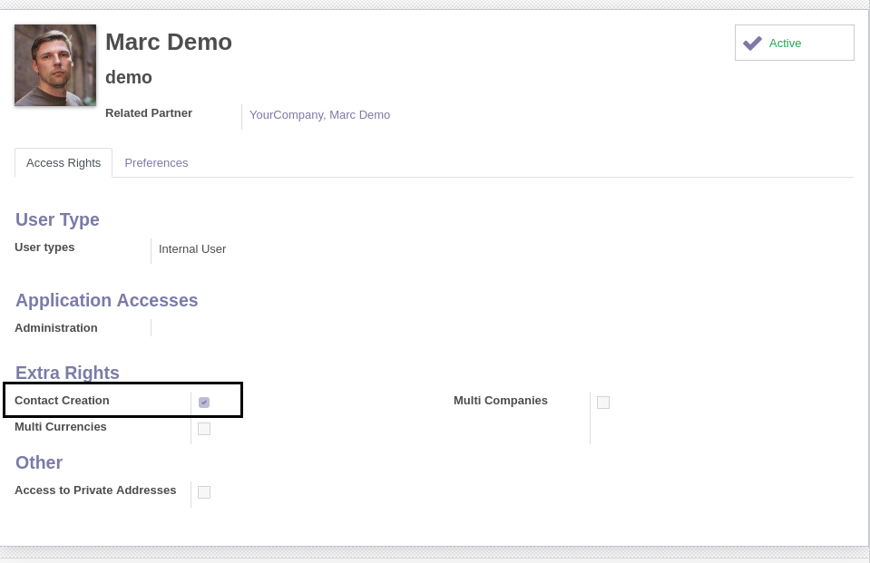
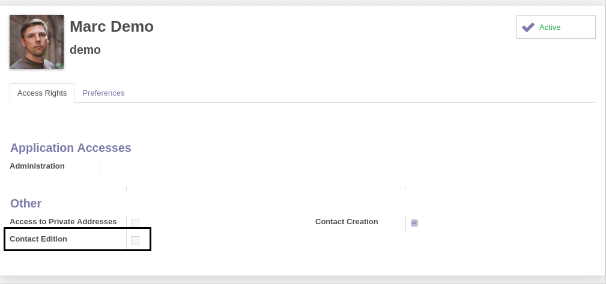
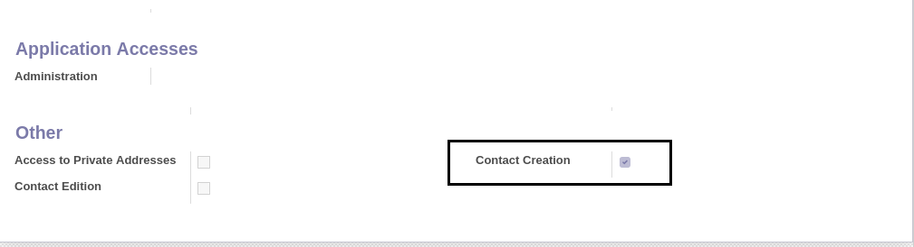
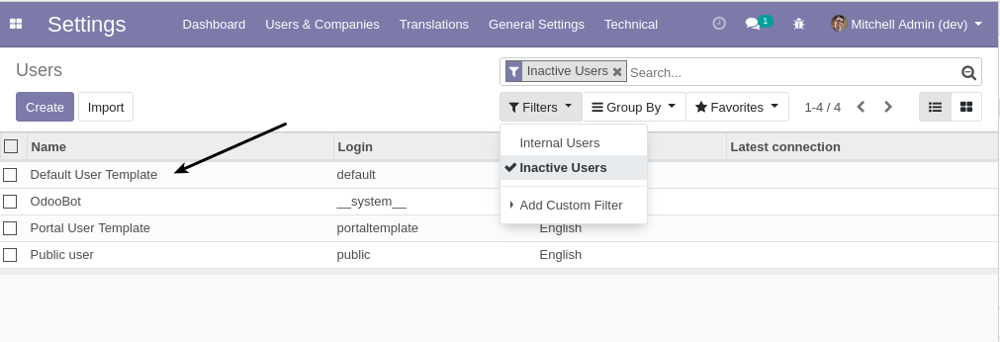
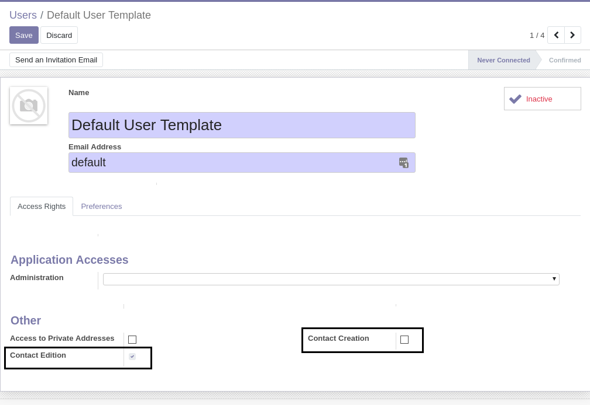
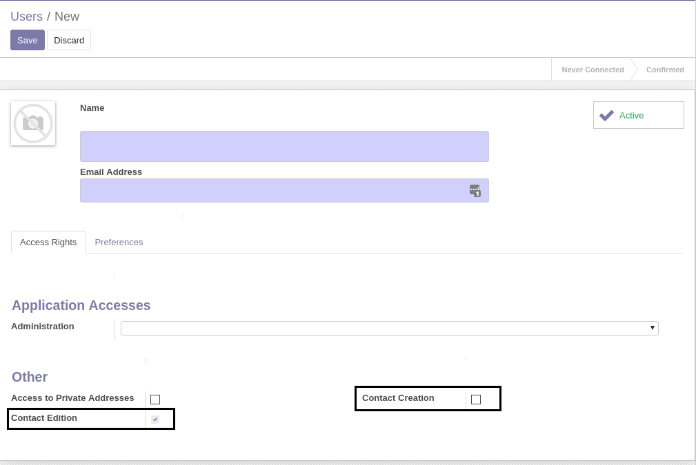

Partner Edit Group
==================

.. contents:: Table of Contents

Context
-------
In vanilla Odoo, there is a group `Extra Rights / Contact Creation`.

This group allows to create / edit / delete partners.

It is only visible in debug mode.

When creating a new user, the group is automatically checked.
This is inconvenient if you do not wish to give all your users access to create new partners.

Contact Edition Group
---------------------
This module adds a group `Contact Edition`.

This group is allowed to edit existing partners without creating new ones.

Bank Accounts
~~~~~~~~~~~~~
The `Contact Edition` group is allowed to add new bank accounts to partners.

However, it is not allowed to edit or create banks.

Contact Edition Group
---------------------
The module moves the group `Contact Creation` to the section `Other`.

This makes the checkbox visible without debug mode.

Default Groups
--------------
You may change the groups checked by default.

To do so, go to `Settings / Users` and select the `Inactive Users` filter. Then, click on `Default User Template`.

In the form view of the default user, you may uncheck `Contact Creation` and check `Contact Edition`.

When creating a new user, these values will be used by default.

Contributors
------------
* Numigi (tm) and all its contributors (https://bit.ly/numigiens)

More information
----------------
* Meet us at https://bit.ly/numigi-com

