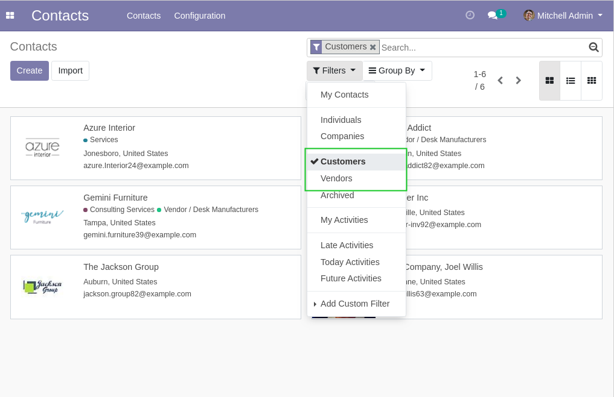

Partner Filters Simplified
==========================
This module simplifies the ``Customers`` and ``Suppliers`` filters on the list view of partners.

.. contents:: Table of Contents

Context
-------
Odoo comes by default with 2 filters ``Customers`` and ``Suppliers`` on partners.

These filters hide contacts and addresses (they only show partners with no parent).

Usage
-----
After the installation, the two filters show all customers or suppliers.

.. image:: static/description/partner_list_after.png

Contributors
------------
* Numigi (tm) and all its contributors (https://bit.ly/numigiens)
