Partner Validation Sale
=======================
This module adds a customer validation workflow.
A customer needs to be approved before any sale order or delivery order is confirmed.

Customer Approval Group
-----------------------
A new group `Customer Approval` is added.

.. image:: static/description/customer_approval_group.png

This group allows to approve a partner as a customer.

Customer State
--------------
In the form view of a partner, a new field `Customer State` is added.

.. image:: static/description/partner_form.png

This field has 3 values:

* New
* Confirmed
* Approved

It is only visible if the partner is a customer.
It is only visible on a commercial partner (i.e. it is not visible on a contact or a billing address).

Confirm
~~~~~~~
The `Confirm` button changes the customer state to `Confirmed`.

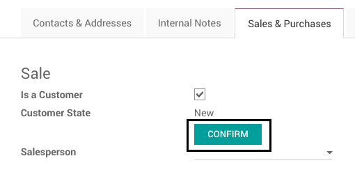

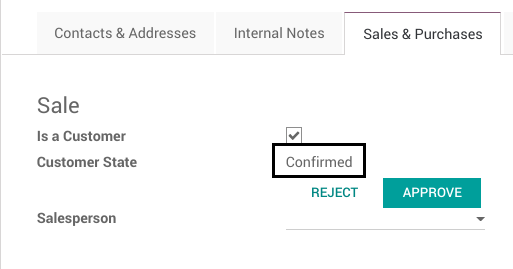

Any user with write access to the partner can click on the button.

Approve
~~~~~~~
The `Approve` button changes the customer state to `Approved`.

.. image:: static/description/partner_form_approve_button.png

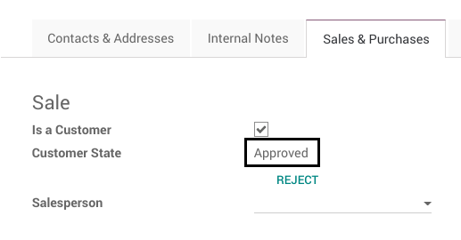

Only members of the group `Customer Approval` can click on the button.
The button is invisible for other users.

Reject
~~~~~~
The `Reject` button changes the customer state to `New`.

.. image:: static/description/partner_form_reject_button.png

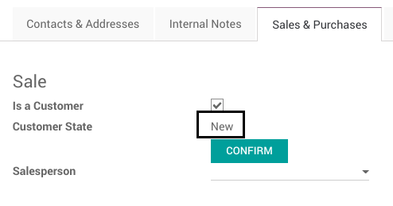

Any user with write access to the partner can click on the button.

Sale Order Confirmation
-----------------------
When confirming a quotation, if the commercial partner related to the customer is not approved
as a customer, a blocking message is shown to the user.

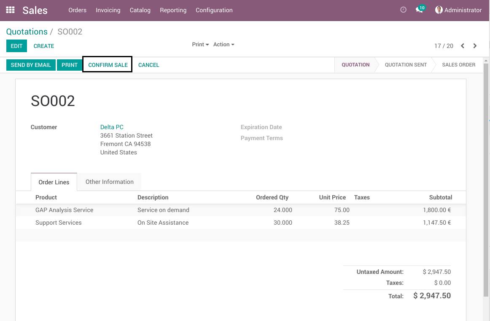

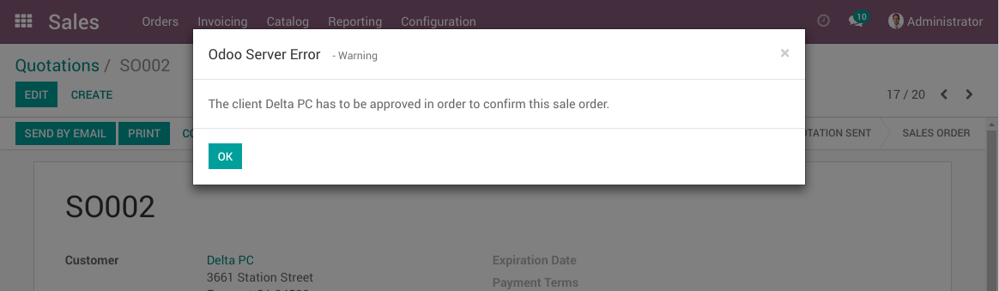

The customer must be approved by a member of the `Customer Approval` Group before
confirming the sale order.

Delivery Validation
-------------------
When validating a delivery order, if the commercial partner related to the customer is not approved
as a customer, a blocking message is shown to the user.

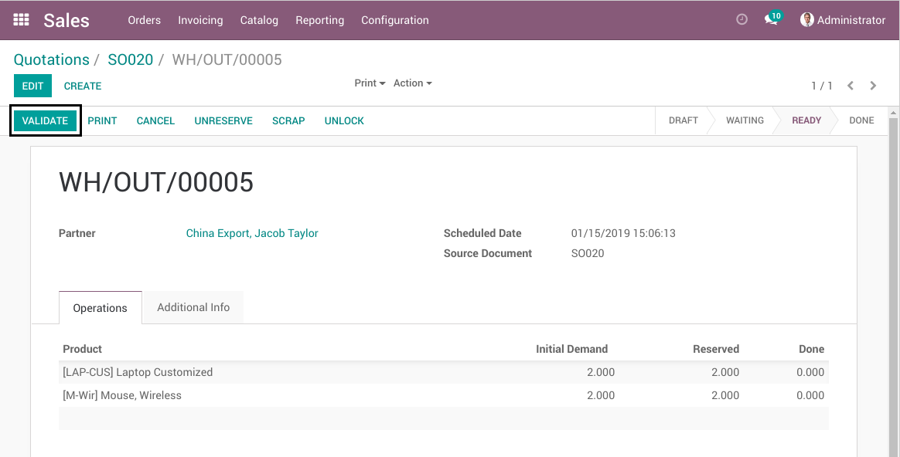

.. image:: static/description/delivery_form_error_message.png

The customer must be approved by a member of the `Customer Approval` group before
validating the delivery order.

Restricted Fields
-----------------
The restricted fields are documented with the module `partner_validation` https://github.com/Numigi/odoo-partner-addons/tree/11.0/partner_validation.

When editing the value of a restricted field on an approved customer, it shows a blocking message,
if the user is not member of the group `Customer Approval`.

Suppose we have the following restricted fields for sales.

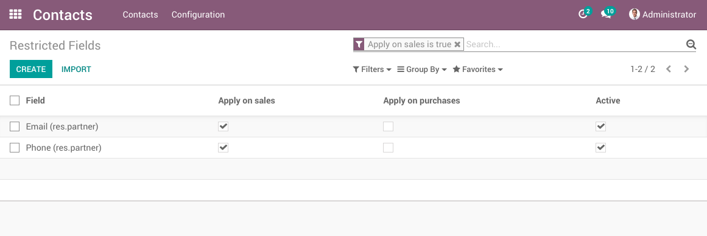

As a user with no extra privileges, go to the form view of an approved customer.

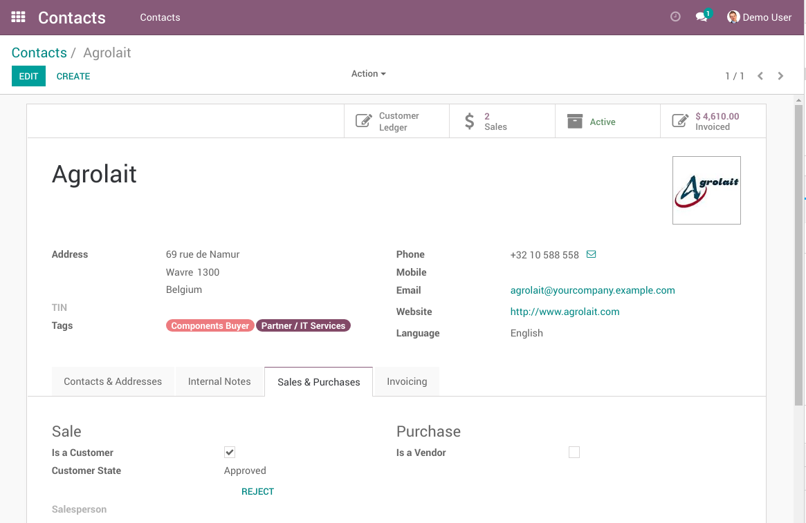

Change the value of one restricted field.

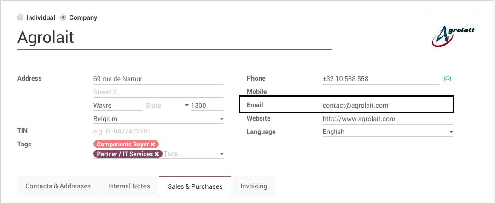

The blocking message is shown.

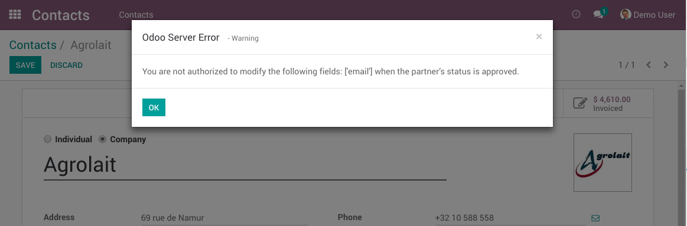

Contributors
------------
* Numigi (tm) and all its contributors (https://bit.ly/numigiens)
* Akretion

More information
----------------
* Meet us at https://bit.ly/numigi-com
