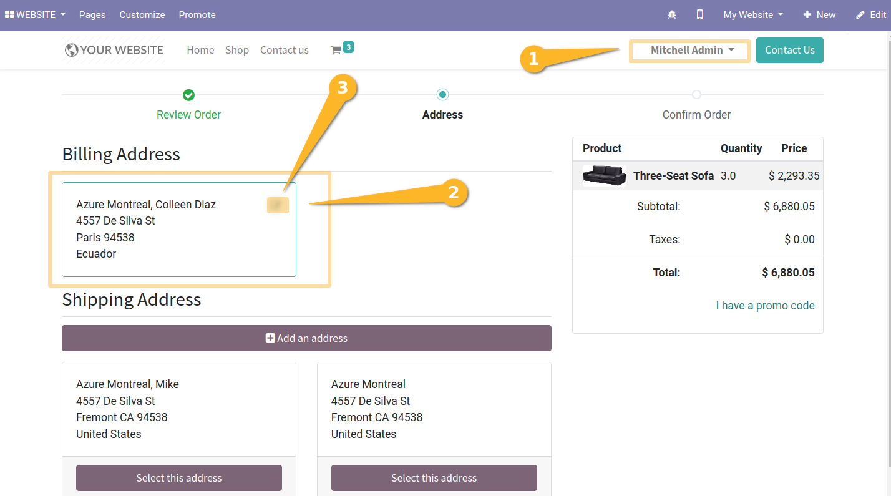

Website Sale Partner Affiliate Invoice Address
==============================================

.. contents:: Table of Contents

Context
-------
The module, with the module `partner_affiliate_invoicing_address` as dependency, allows to use another invoicing address on ecommerce billing page.

Usage
-----
As an `Azure Montreal` portal user or one of its children like `Mitchel Admin`, I go to the website and see that the billing address used is the billing address defined as the billing address to use.

.. image:: static/description/user_contact_invoice_address.png.png

Notice : in the example, `Coleen Diaz` is used for invoice address, and belongs to `Azure Montreal`.
In the other case, the native restriction for security is applied that it is ``FORBIDDEN``.

Contributors
------------
* Numigi (tm) and all its contributors (https://bit.ly/numigiens)

More information
----------------
* Meet us at https://bit.ly/numigi-com
